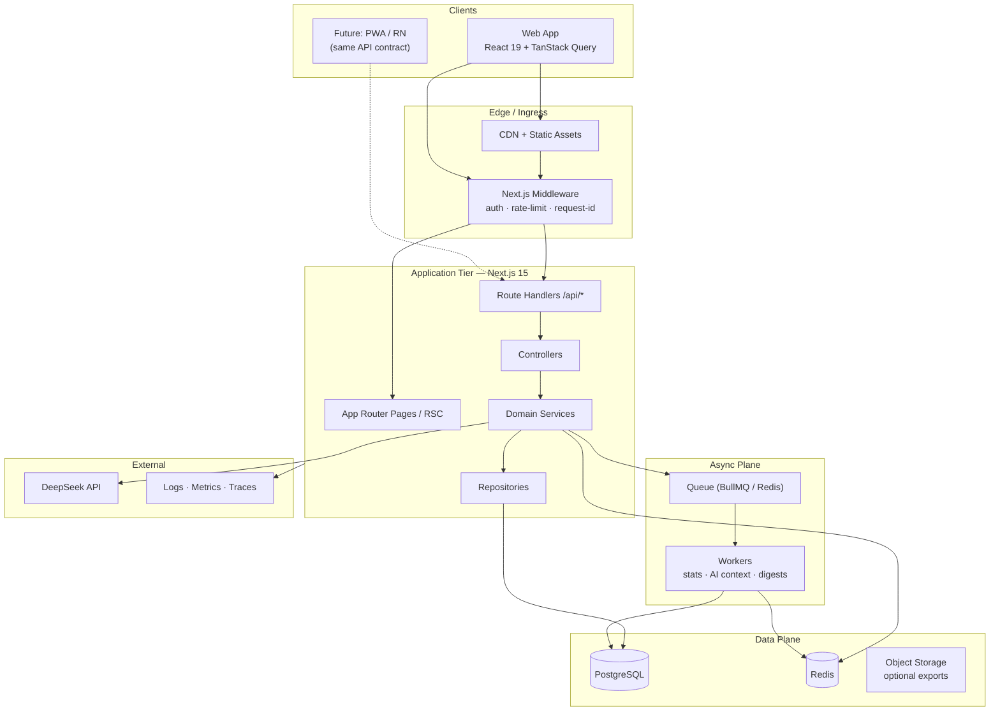
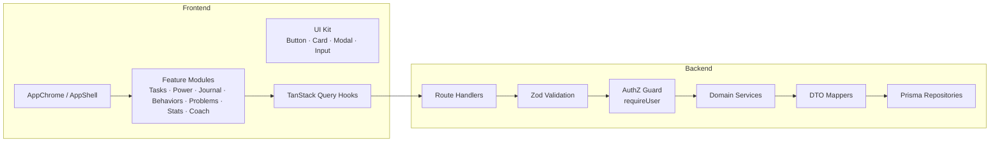
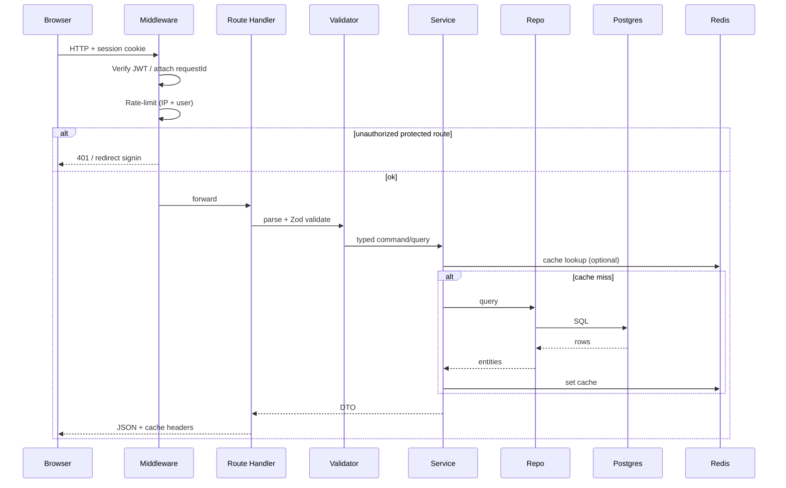
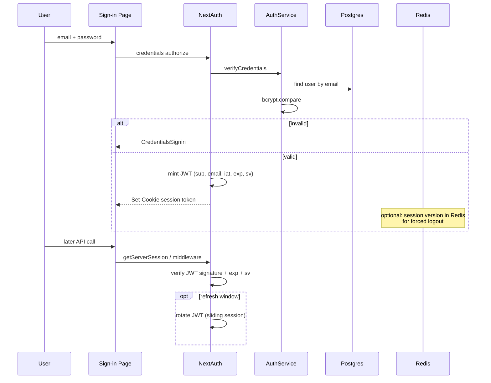
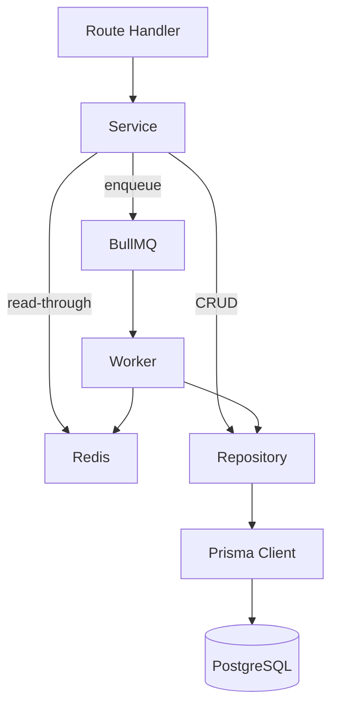
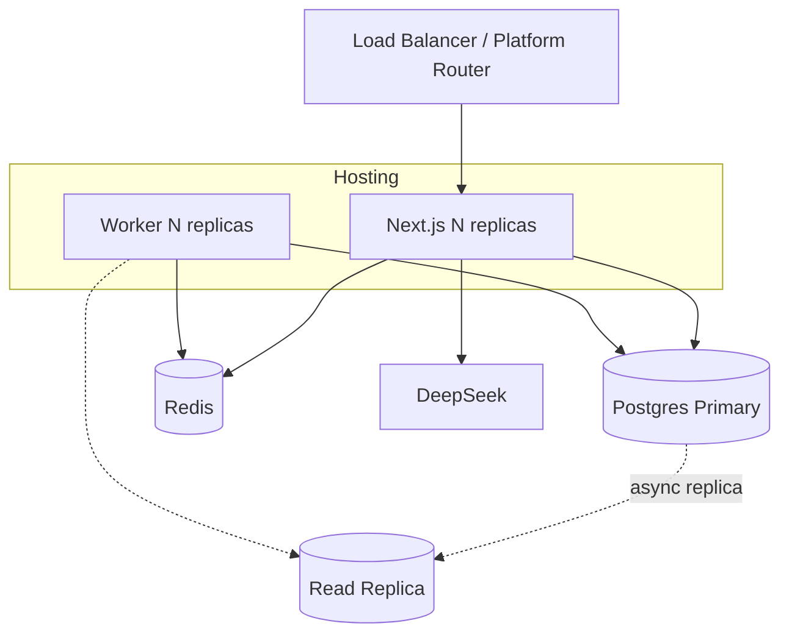
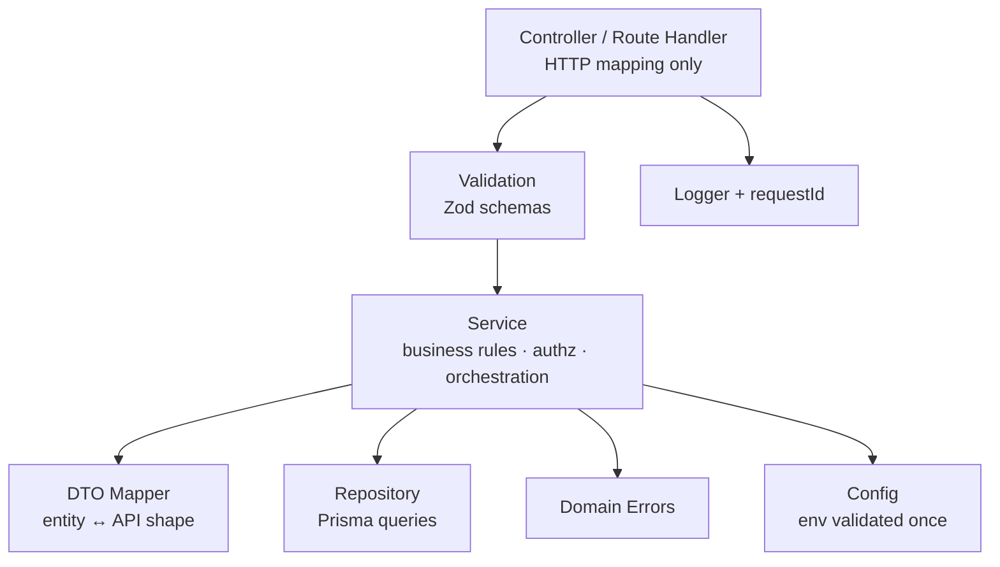
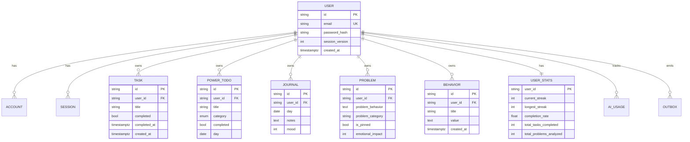
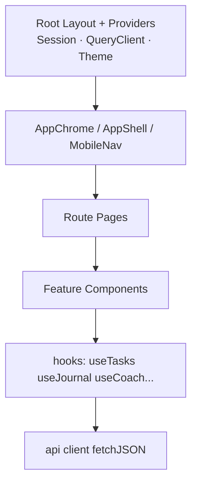
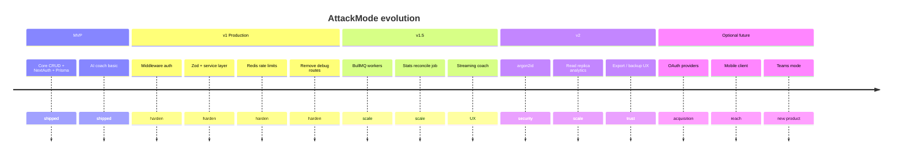

# AttackMode (Habitify) — Software Engineering Design Document
**Interview-Ready | Internal Engineering Style**

| Field | Value |
|-------|-------|
| Product | AttackMode — personal productivity & identity system |
| Codename / Repo | Habitify |
| Doc status | Evolved production architecture (idealized from MVP) |
| Audience | Hiring managers, senior eng interviewers, self-prep |
| Stack spine | Next.js 15 · React 19 · TypeScript · Prisma · PostgreSQL · NextAuth · Redis · DeepSeek |
| Scale target discussed | 100 → 10M users |
| **Juspay Final Round** | See [`JUSPAY_FINAL_ROUND_PREP.md`](./JUSPAY_FINAL_ROUND_PREP.md) — OS, CN, TLS, DSA, concurrency, behavioral (Q161–Q235) |

> **How to read this doc:** Sections 1–14 describe the *idealized production system* that naturally evolved from the Habitify MVP. Features stay grounded in the real product (tasks, power system, journal, behaviors, problem-solving, AI coach, stats, credentials auth). Infrastructure layers (services, Redis, queues, middleware) are presented as intentional evolution. The closing bridge section is honest about the real codebase gaps. **For Juspay Final Onsite, also study `JUSPAY_FINAL_ROUND_PREP.md`** — it covers OS, networking, DSA, and cultural rounds not fully repeated here.

---

# Executive Summary

AttackMode is a **single-tenant-per-user productivity and identity system**. Users build daily discipline across three power axes (**brain / muscle / money**), log mood and journal, capture behavior slips, run structured problem-solving worksheets, and talk to an AI coach grounded in their own activity data.

**Core product loop**

```text
Plan day (tasks + power todos)
  → Act & check off
    → Reflect (journal / mood / behaviors)
      → Analyze (problem worksheets)
        → Coach (AI + personal context)
          → Measure (streaks, completion, analytics)
```

**Engineering thesis**

| Thesis | Implication |
|--------|-------------|
| Personal data is sacred | Strict user-scoped queries; no cross-user reads; JWT + middleware gate |
| Write path is hot, analytics is cold | OLTP Postgres for CRUD; Redis for session/rate-limit/cache; async jobs for heavy stats & AI context |
| AI is a feature, not the product | Coach is rate-limited, context-bounded, and fail-soft; core CRUD never depends on LLM uptime |
| Monolith-first, extract-later | One Next.js deployable until a clear bottleneck (AI queue, analytics warehouse) forces a split |

**What this system is *not*** (intentionally)

- Not a social network, marketplace, or payments product
- Not multi-tenant B2B SaaS (no org/team model in MVP→v1)
- Not a realtime collaborative editor

**30-second architecture soundbite**

> Full-stack Next.js App Router monolith. PostgreSQL + Prisma for durable state. NextAuth JWT credentials with middleware protection. Redis for cache, rate limits, and short-lived AI context. Background workers for stats recompute and coach context assembly. TanStack Query on the client for cache-coherent UI.

---

# System Architecture

## 1. High-level architecture



### Why this shape
- **One deployable** keeps interview stories coherent and ops cheap at &lt;100k users.
- **Redis + queue** appear the moment AI context assembly and streak recompute become latency-sensitive.
- **CDN** only for static; all authenticated HTML/API stays origin-bound (cookies).

### Trade-offs
| Choice | Gain | Cost |
|--------|------|------|
| Monolith | Simple deploys, shared types | Blast radius if AI route stalls Node |
| Sync CRUD + async analytics | Snappy UX | Eventual consistency on streak numbers |
| JWT sessions | Horizontally scalable app tier | Revocation needs denylist or short TTL |

### What if 100×
- Split **AI worker** and **analytics reader** first; keep CRUD monolith.
- Move analytics to read replica / warehouse; keep Postgres primary for writes.

---

## 2. Component architecture



**Module boundaries (logical packages inside `src/`)**

| Package | Responsibility |
|---------|----------------|
| `app/` | Routes, layouts, RSC entry |
| `components/` | Presentational + feature UI |
| `lib/auth/` | NextAuth config, session helpers |
| `lib/server/` | HTTP helpers, `requireUser`, errors |
| `modules/*/service` | Business rules |
| `modules/*/repo` | Prisma access only |
| `modules/*/dto` | Request/response shapes |
| `jobs/` | Worker handlers |
| `config/` | Env-validated config |

---

## 3. Request lifecycle



---

## 4. Auth flow



**Elevated design vs MVP**

| Concern | MVP (real) | Production (this doc) |
|---------|------------|------------------------|
| Route protection | `src/middleware.ts` + `requireUser` | Keep AuthGuard as UX only |
| Session | JWT, no refresh design | Short access TTL + sliding refresh / version check |
| Rate limit login | None | Redis token bucket per IP+email |
| Password | bcrypt | bcrypt cost 12 + breached-password check later |

---

## 5. Database interaction pattern



**Rules**
1. **Never** call Prisma from React components or route handlers beyond a thin controller.
2. Every query includes `userId` from the verified session — never from the request body alone.
3. Stats are **derived**; `UserStats` is a materialization updated by jobs + cheap incremental hooks.

---

## 6. Deployment architecture



| Environment | Topology |
|-------------|----------|
| Dev | Next + local Postgres + optional Redis |
| Staging | Single Next, managed Postgres, Redis |
| Prod &lt;100k | Next (platform) + managed Postgres + Redis + 1 worker |
| Prod 1M+ | Multi-region app, primary+replica, worker fleet, AI circuit breaker |

---

# Technology Stack

For each technology: purpose, why, alternatives, trade-offs, advantages, limitations, scaling, 30s answer, follow-ups.

## Next.js 15 (App Router)

| Dimension | Detail |
|-----------|--------|
| **Purpose** | Full-stack web framework: routing, RSC, API route handlers, middleware |
| **Why** | One TypeScript codebase; server components for authenticated shells; edge-capable middleware for auth |
| **Alternatives** | Remix, Nest+SPA, Rails+HTMX |
| **Trade-offs** | Framework coupling vs polyglot microservices; RSC mental model cost |
| **Advantages** | Colocated UI+API; great DX; Turbopack; Vercel/any Node host |
| **Limitations** | Long-running AI in serverless needs timeout design; cold starts |
| **Scaling** | Horizontal replicas; offload AI to workers before hitting function limits |
| **30s** | “We use Next App Router as a modular monolith: pages + `/api`, middleware for auth, Prisma on Node runtime.” |
| **Follow-ups** | When RSC vs client? Why not separate Nest API? How do you handle 60s LLM calls? |

## React 19

| Dimension | Detail |
|-----------|--------|
| **Purpose** | UI composition, client interactivity |
| **Why** | Ecosystem, TanStack Query fit, component model for modals/dashboards |
| **Alternatives** | Solid, Svelte, Vue |
| **Trade-offs** | Bundle size vs familiarity |
| **Advantages** | Hiring pool, libraries (Recharts, Lucide) |
| **Limitations** | Easy to over-client-render |
| **Scaling** | Code-split routes; defer charts |
| **30s** | “React 19 for interactive surfaces; keep lists and forms client, prefer RSC for shells.” |
| **Follow-ups** | Concurrent features? Why not server actions only? |

## TypeScript

| Dimension | Detail |
|-----------|--------|
| **Purpose** | Static contracts across FE/BE/DTO |
| **Why** | Prevents entire classes of API mismatch bugs |
| **Alternatives** | JS + Zod only, Kotlin, Go |
| **Trade-offs** | Build time vs safety |
| **Advantages** | Shared types, refactor confidence |
| **Limitations** | `any` escape hatches if undisciplined |
| **Scaling** | Project references / packages if monorepo grows |
| **30s** | “TS end-to-end with Zod at the boundary — types inside, validation at the edge.” |
| **Follow-ups** | Strict mode? How do you share types with workers? |

## Tailwind CSS v4

| Dimension | Detail |
|-----------|--------|
| **Purpose** | Utility-first styling |
| **Why** | Fast iteration for dense productivity UI |
| **Alternatives** | CSS Modules, styled-components, Chakra |
| **Trade-offs** | Class noise vs design-token discipline |
| **Advantages** | Consistent spacing/radius; small runtime |
| **Limitations** | Design system needs component wrappers |
| **Scaling** | Extract UI kit; purge unused |
| **30s** | “Tailwind for speed; UI primitives encode brand tokens so pages don’t invent colors.” |
| **Follow-ups** | Dark mode strategy? Accessibility? |

## TanStack Query

| Dimension | Detail |
|-----------|--------|
| **Purpose** | Client server-state cache, mutations, invalidation |
| **Why** | Tasks/journal/power lists are classic remote state |
| **Alternatives** | SWR, RTK Query, RSC-only fetch |
| **Trade-offs** | Another cache layer vs server-only |
| **Advantages** | Optimistic updates, retries, Devtools |
| **Limitations** | Stale time tuning; dual-cache bugs with RSC |
| **Scaling** | Query key factories per domain; prefetch |
| **30s** | “TanStack Query owns client cache; mutations invalidate domain keys like `['tasks', userId]`.” |
| **Follow-ups** | Optimistic complete-task? Race conditions? |

## Prisma + PostgreSQL

| Dimension | Detail |
|-----------|--------|
| **Purpose** | ORM + relational system of record |
| **Why** | Strong relations (User→many domains), constraints, transactions, SQL ecosystem |
| **Alternatives** | Drizzle, TypeORM, raw SQL; Mongo (rejected) |
| **Trade-offs** | Prisma migrate discipline vs schema flexibility |
| **Advantages** | Type-safe client, migrations, indexes in schema |
| **Limitations** | Complex analytics SQL may need `$queryRaw`; cold connection pooling |
| **Scaling** | PgBouncer, replicas, partitioning by `user_id` later |
| **30s** | “Postgres is source of truth; Prisma for type-safe CRUD; Redis never replaces durability.” |
| **Follow-ups** | Why not Mongo? N+1? Migrations in CI? |

### Why not Mongo (mongoose is unused leftover)
- Identity/productivity data is **relational** (user owns tasks, unique journal-per-day, foreign keys).
- We need **transactions** for “complete task + bump stats”.
- Ad-hoc documents for problem worksheets still fit as text columns; no need for document DB as primary.
- **Trade-off:** schema migrations required — accepted.

## NextAuth (Auth.js) — Credentials + JWT

| Dimension | Detail |
|-----------|--------|
| **Purpose** | AuthN sessions for first-party credentials |
| **Why** | Fits Next; Prisma adapter ready for OAuth later; JWT for serverless |
| **Alternatives** | Lucia, Clerk, Cognito, custom JWT |
| **Trade-offs** | Credentials provider is DIY vs hosted IdP |
| **Advantages** | Cookie sessions, callbacks, custom pages |
| **Limitations** | Revocation, MFA, password reset need extra design |
| **Scaling** | Stateless JWT + Redis session version |
| **30s** | “NextAuth JWT credentials today; middleware verifies; Redis session version for logout-all.” |
| **Follow-ups** | Why JWT not DB sessions? Refresh? CSRF? |

## bcryptjs

| Dimension | Detail |
|-----------|--------|
| **Purpose** | Password hashing |
| **Why** | Proven, slow-by-design |
| **Alternatives** | argon2id (preferred long-term), scrypt |
| **Trade-offs** | bcrypt 72-byte limit; argon2 stronger vs ecosystem |
| **Advantages** | Ubiquitous |
| **Limitations** | CPU cost on login spikes |
| **Scaling** | Rate-limit auth; consider argon2 migration |
| **30s** | “bcrypt cost 12; migrate path to argon2id without downtime via algorithm prefix.” |
| **Follow-ups** | Timing attacks? Pepper? |

## Redis

| Dimension | Detail |
|-----------|--------|
| **Purpose** | Cache, rate limits, queue backend, session version |
| **Why** | Sub-ms shared state across app replicas |
| **Alternatives** | Memcached, Postgres UNLOGGED, Upstash |
| **Trade-offs** | Operational complexity vs DB load |
| **Advantages** | Multi-purpose |
| **Limitations** | Memory; must tolerate flush |
| **Scaling** | Cluster / managed Redis |
| **30s** | “Redis is ephemeral: never sole source of truth; backs rate limits, hot reads, BullMQ.” |
| **Follow-ups** | Cache invalidation? Stampede? |

## BullMQ (queue workers)

| Dimension | Detail |
|-----------|--------|
| **Purpose** | Async jobs: stats recompute, AI context warm, digests |
| **Why** | Keep HTTP &lt;200ms for writes; isolate LLM latency |
| **Alternatives** | Inngest, SQS+Lambda, Temporal |
| **Trade-offs** | Worker ops vs simplicity |
| **Advantages** | Retries, backoff, concurrency caps |
| **Limitations** | At-least-once → idempotent handlers |
| **Scaling** | Horizontal workers; per-queue concurrency |
| **30s** | “Mutations enqueue; workers recompute streaks and warm coach context idempotently.” |
| **Follow-ups** | Poison messages? Exactly-once? |

## DeepSeek (AI coach)

| Dimension | Detail |
|-----------|--------|
| **Purpose** | LLM coaching grounded in user activity |
| **Why** | Cost-effective chat; product differentiator |
| **Alternatives** | OpenAI, Anthropic, local models |
| **Trade-offs** | Vendor lock / quality vs cost |
| **Advantages** | Cheap tokens for daily coaching |
| **Limitations** | Latency, hallucinations, PII in prompts |
| **Scaling** | Queue + rate limit + circuit breaker; truncate context |
| **30s** | “Coach builds a bounded context from DB, calls DeepSeek with timeout; fail-soft if down.” |
| **Follow-ups** | Prompt injection? Data retention? Streaming? |

## Recharts

| Dimension | Detail |
|-----------|--------|
| **Purpose** | Stats charts |
| **Why** | React-native charting for completion/mood trends |
| **Alternatives** | Chart.js, Visx, server-rendered SVG |
| **Trade-offs** | Bundle size vs polish |
| **Advantages** | Declarative |
| **Limitations** | Heavy for mobile; lazy-load |
| **Scaling** | Aggregate server-side; send series not raw events |
| **30s** | “Recharts consumes pre-aggregated analytics DTOs, not raw rows.” |
| **Follow-ups** | SSR charts? Accessibility? |

## date-fns

| Dimension | Detail |
|-----------|--------|
| **Purpose** | Date math for streaks, journal day keys |
| **Why** | Tree-shakeable vs moment |
| **Alternatives** | Luxon, Temporal |
| **Trade-offs** | Timezone bugs if naive |
| **Advantages** | Small |
| **Limitations** | Need explicit TZ policy (user local day) |
| **Scaling** | Store UTC; bucket by user TZ |
| **30s** | “All timestamps UTC; ‘today’ computed in user timezone for streaks/journal uniqueness.” |
| **Follow-ups** | DST edge cases? |

## Zod (validation layer — production)

| Dimension | Detail |
|-----------|--------|
| **Purpose** | Runtime request validation |
| **Why** | TS types erased at runtime |
| **Alternatives** | Yup, Valibot, manual |
| **Trade-offs** | Boilerplate vs safety |
| **Advantages** | Infer types from schemas |
| **Limitations** | Must keep DTOs synced |
| **Scaling** | Shared package |
| **30s** | “Every write path: Zod parse → service. Invalid → 400 problem+json.” |
| **Follow-ups** | OpenAPI generation? |

---
# Backend Architecture

## Layering (why each exists)



| Layer | Allowed | Forbidden |
|-------|---------|-----------|
| Controller | status codes, cookies, call service | business ifs, Prisma |
| Service | rules, transactions, enqueue jobs | `NextRequest`, React |
| Repository | Prisma, SQL | auth decisions (except receiving `userId`) |
| DTO | shape transforms | DB calls |

### Why layers
- **Interview clarity:** you can point to where rate limits, authz, and SQL live.
- **Testability:** services unit-tested with fake repos.
- **100×:** swap Redis cache or read replica inside repo without rewriting handlers.

## Controllers (Route Handlers)

Pattern:

```text
POST /api/tasks
  → parseJson
  → CreateTaskSchema.parse
  → requireUser()
  → taskService.create(userId, dto)
  → 201 + TaskDTO
```

Thin by design. Idempotency-Key header checked here for POSTs that matter.

## Services (domain examples)

| Service | Responsibilities |
|---------|------------------|
| `TaskService` | create/list/toggle/delete; emit `TASK_COMPLETED` |
| `PowerSystemService` | category validation brain\|muscle\|money; day scoping |
| `JournalService` | upsert by (userId, date); mood bounds 1–10 |
| `BehaviorService` | append-only log; list with cursor |
| `ProblemService` | CRUD worksheets; pin limits |
| `StatsService` | incremental counters + enqueue full recompute |
| `CoachService` | build context, call LLM, enforce quotas |
| `AuthService` | register, password verify, session version bump |

## Repositories

- One repo per aggregate: `TaskRepository`, `JournalRepository`, …
- Methods accept **explicit `userId`** always.
- Use transactions for multi-table updates (`prisma.$transaction`).

## DTOs

| DTO | Direction |
|-----|-----------|
| `CreateTaskRequest` | in |
| `TaskResponse` | out (no internal fields) |
| `AnalyticsSeriesResponse` | out aggregated |
| `CoachChatRequest/Response` | in/out; strip secrets |

Never return `password` hash. Never trust client `userId`.

## Validation

- Zod at boundary; enums for `category`, mood ranges, string max lengths (title 200, journal text 20k, coach message 4k).
- Strip unknown keys (`strict` or `strip`).

## Config

```text
DATABASE_URL
REDIS_URL
NEXTAUTH_SECRET
NEXTAUTH_URL
DEEPSEEK_API_KEY
DEEPSEEK_BASE_URL
BCRYPT_COST=12
RATE_LIMIT_AI_PER_HOUR=30
SESSION_MAX_AGE=7d
```

Validated at boot with Zod — fail fast.

## Dependency injection

Lightweight: factory functions / module singletons (`getPrisma()`, `getRedis()`, `getTaskService()`). No Nest-style container required until multi-worker complexity demands it.

**Why:** YAGNI for ~10k LOC; still testable via injection points.

## Error model

| Error class | HTTP | Example |
|-------------|------|---------|
| `ValidationError` | 400 | mood > 10 |
| `UnauthorizedError` | 401 | no session |
| `ForbiddenError` | 403 | wrong resource owner |
| `NotFoundError` | 404 | task id missing for user |
| `ConflictError` | 409 | journal unique day |
| `RateLimitError` | 429 | AI quota |
| `DependencyError` | 503 | DeepSeek down |

Map to JSON: `{ error, code, requestId }`.

## Logging & monitoring

- Structured JSON logs: `requestId`, `userId`, `route`, `latencyMs`, `outcome`.
- Metrics: p50/p95 API latency, error rate, AI token usage, queue depth, DB pool wait.
- Traces: OpenTelemetry on handler → service → Prisma → Redis.
- **Never** log passwords, JWT, or full journal text in prod (PII policy).

## Jobs & queues

| Job | Trigger | Idempotency key |
|-----|---------|-----------------|
| `recomputeUserStats` | task/power complete | `stats:{userId}:{day}` |
| `warmCoachContext` | after daily activity | `coachctx:{userId}:{day}` |
| `purgeExpiredSessions` | cron | date |
| `aggregateAnalyticsDaily` | cron | `analytics:{day}` |

Workers must tolerate retries (at-least-once).

---

# Database Design

## Ideal schema (evolved from Prisma models)

Core entities remain: User, Task, PowerSystemTodo, JournalEntry, ProblemSolvingEntry, BehaviorEntry, UserStats + NextAuth tables. Production adds:

| Addition | Why |
|----------|-----|
| `sessionVersion` on User | logout-all, revoke |
| `AiUsageDaily` | enforce quotas |
| `OutboxEvent` | reliable job publish |
| Enums for category | DB-level integrity |
| Soft-delete optional on problems | recovery |

### ER diagram



## Indexes & constraints

| Table | Index / Constraint | Why |
|-------|-------------------|-----|
| users | UNIQUE(email) | login |
| tasks | (user_id, completed), (user_id, created_at DESC) | list filters |
| power_system_todos | (user_id, date), (user_id, category) | daily power board |
| journal_entries | UNIQUE(user_id, date) | one entry/day |
| problem_solving | (user_id, is_pinned), (user_id, category) | pin list |
| behavior_entries | (user_id, created_at DESC) | history feed |
| user_stats | UNIQUE(user_id) | 1:1 |
| CHECK mood BETWEEN 1 AND 10 | integrity |
| CHECK category IN ('brain','muscle','money') | integrity |
| FK ON DELETE CASCADE | user deletion |

## Normalization vs denormalization

| Data | Form | Why |
|------|------|-----|
| Tasks, journal, behaviors | 3NF | source correctness |
| UserStats | Denormalized counters | avoid COUNT(*) on every dashboard |
| Analytics charts | Pre-aggregated daily rollups (future) | 100× read path |
| Coach context | Cached JSON in Redis | LLM prompt assembly cost |

## Query patterns

1. **Today's board:** tasks incomplete + power todos for `day = today(tz)` — indexed.
2. **Journal upsert:** `ON CONFLICT (user_id, date) DO UPDATE`.
3. **Stats dashboard:** read `user_stats` + last 30d rollups — not raw scan.
4. **Coach context:** bounded queries (today tasks, last 7 journals, streak) — timeout budget.

## Scalability of data model

| Scale | Action |
|-------|--------|
| 100 users | single Postgres, no partition |
| 100k | connection pooler; indexes as above |
| 1M | read replica for analytics; archive old behaviors |
| 10M | partition large tables by hash(user_id) or time; warehouse for BI |

## Why PostgreSQL

- Relational integrity for user-owned graphs
- Partial indexes, UPSERT, JSON when needed
- Mature backup/PITR
- Avoids dual-write Mongo+SQL mess (mongoose leftover is technical debt, not architecture)

---

# Authentication & Authorization

## Authentication

| Aspect | Design |
|--------|--------|
| Protocol | Email/password → NextAuth Credentials |
| Session | Signed JWT in httpOnly secure cookie |
| TTL | Access ~1h sliding; absolute 7d |
| Refresh | Re-issue JWT when within refresh window; embed `sv` (session version) |
| Logout | Clear cookie + `User.sessionVersion++` (all devices) |
| Password | bcrypt cost 12; constant-time compare |
| Lockout | Redis: N failures → cooldown |

## Authorization

- **Model:** ownership-based. Resource accessible iff `resource.userId === session.userId`.
- **Enforcement:** middleware (page routes) + `requireUser` (API) + repo filters.
- **No roles** in v1 (single-user product). Future: optional coach/admin role.

## Middleware vs client AuthGuard

| Layer | Job |
|-------|-----|
| Middleware | Redirect unauthenticated users; attach request id; coarse rate limit |
| Server components | `getServerSession` before rendering private data |
| API | `requireUser` mandatory |
| Client AuthGuard | UX only — **never** security boundary |

## CSRF / XSS

- SameSite=Lax cookies; NextAuth CSRF token on sign-in
- CSP headers; sanitize any future markdown render
- No JWT in localStorage

---

# API Design

## Style

RESTful JSON under `/api/v1/...` (version prefix in production evolution; MVP used unversioned `/api/...`).

| Resource | Methods |
|----------|---------|
| `/tasks` | GET list, POST create |
| `/tasks/:id` | PATCH, DELETE |
| `/power-system` | GET, POST |
| `/power-system/:id` | PATCH, DELETE |
| `/journal` | GET, PUT upsert |
| `/behaviors` | GET, POST |
| `/problems` | GET, POST |
| `/problems/:id` | GET, PATCH, DELETE |
| `/stats` | GET |
| `/analytics` | GET `?range=30d` |
| `/ai/chat` | POST, GET insights |
| `/auth/register` | POST |

## Validation & errors

- 400 validation with field paths
- Uniform error envelope
- 404 for cross-user IDs (don’t leak existence — same 404)

## Pagination

Cursor-based for behaviors/problems:

```json
{ "items": [], "nextCursor": "eyJ..." }
```

Offset OK for small task lists (per-user bounded).

## Rate limiting

| Bucket | Limit (example) |
|--------|-----------------|
| Auth login | 10 / 15 min / IP+email |
| Write APIs | 120 / min / user |
| AI chat | 30 / hour / user |
| AI tokens | daily cap |

Redis sliding window / token bucket. Headers: `X-RateLimit-Remaining`.

## Idempotency

- `Idempotency-Key` on POST create task / AI chat stored in Redis 24h → replay response.
- Stats jobs keyed by user+day.

## Versioning

- `/api/v1` when breaking changes needed
- Additive fields non-breaking
- Deprecation header for old clients

---

# Frontend Architecture



## Principles

1. **Server Components** for shells and static structure.
2. **Client components** for interactive lists, modals, charts, coach chat.
3. **Query key factory** per domain.
4. **Optimistic UI** for checkbox toggles; rollback on error.
5. **UI kit** (`Button`, `Card`, `ModalShell`, `Input`) — cards only for interactive containers.
6. **Accessibility:** focus traps in modals, labeled inputs, keyboard nav.

## State split

| Kind | Tool |
|------|------|
| Server state | TanStack Query |
| Auth session | NextAuth session provider |
| Ephemeral UI | `useState` (modal open) |
| No Redux | YAGNI |

## Routing

App Router pages: `/`, `/stats`, `/behavior-history`, `/solved-problems`, `/auth/*`.

---

# Performance

| Technique | Where |
|-----------|-------|
| DB indexes | all user-scoped lists |
| Redis cache | stats, coach context, analytics series |
| HTTP cache | private, short `Cache-Control` for GET stats |
| RSC streaming | shell first |
| Code split | Recharts, coach panel |
| Connection pooling | PgBouncer / Prisma accelerate optional |
| Avoid N+1 | `include`/`select` carefully; repo methods reviewed |
| LLM | truncate history; max tokens; timeout 15s; queue if needed |
| Icons | Lucide (tree-shakeable) |

**Budgets:** API p95 &lt; 200ms CRUD; AI p95 &lt; 8s (streaming preferred later).

---

# Scalability (100 → 10M users)

| Users | What works | What breaks | Evolution |
|------|------------|-------------|-----------|
| 100 | Single Next + Postgres | nothing | ship features |
| 10k | + Redis rate limit | AI latency spikes | queue AI; cache context |
| 100k | pooler saturation | Prisma connections | PgBouncer; read replica for analytics |
| 1M | hot users hammer stats | lock contention on UserStats | shard counters / per-day rollups; more workers |
| 10M | single-region DB | storage & CPU | partition by user_id; regional read; warehouse; extract Coach service |

**First extract candidates:** AI worker service, analytics read API.

**Do not extract early:** task CRUD microservice — coordination cost &gt; benefit.

---

# Reliability

| Concern | Approach |
|---------|----------|
| DB backups | Daily + PITR |
| Deploy | Rolling / platform preview; migrate expand-contract |
| Health | `/api/health` checks DB+Redis |
| AI failure | 503 with cached insight fallback |
| Poison jobs | DLQ + alert |
| Timeouts | AbortController on fetch to DeepSeek |
| Idempotency | job keys + upsert stats |
| Chaos | game-day: kill Redis — degrade carefully |

**Consistency:** CRUD strong (Postgres). Stats **eventually consistent** within seconds.

---

# Security

| Area | Control |
|------|---------|
| AuthN | bcrypt, JWT httpOnly, middleware |
| AuthZ | ownership checks |
| Input | Zod length limits; parameterized SQL via Prisma |
| Secrets | env only; never client |
| PII | disk encryption; minimize AI prompt PII |
| Prompt injection | system prompt isolation; treat user text as data |
| Headers | HTTPS, HSTS, CSP, secure cookies |
| Dependencies | npm audit / Dependabot |
| Debug routes | remove `create-test-user`, `/api/test`, debug session in prod |
| Least privilege | DB role app CRUD only |

---

# Engineering Trade-offs

| Decision | Chose | Rejected | Why | 100× risk |
|----------|-------|----------|-----|-----------|
| Monolith Next | Yes | Microservices | speed & coherence | AI noisy neighbor → extract worker |
| JWT | Yes | DB sessions | serverless scale | revocation → session version |
| Postgres | Yes | Mongo primary | relations & TX | large behavior logs → partition |
| Sync stats bump | Incremental + async full | Always COUNT | UX speed | drift → nightly reconcile |
| DeepSeek | Yes | Only OpenAI | cost | quality → multi-provider |
| Client AuthGuard | UX only | as security | insecure alone | — |
| Redis | Yes in prod | DB-only | rate limit & cache | Redis down policy |
| Credentials auth | Yes | social-only | product simplicity | add OAuth later |

---

# Future Improvements (MVP → production roadmap)



---
# Interview Preparation

> Format for every question: **Ideal answer** · **Common mistakes** · **Strong follow-up answer**  
> Aim: sound like an engineer who designed for production, not someone who memorized file names.

---

## A. Product & Scope (Q1–Q8)

### Q1. What is AttackMode in one sentence?
**Ideal:** A personal productivity and identity system where users execute daily tasks across brain/muscle/money, reflect via journal and behaviors, analyze problems structurally, and get an AI coach grounded in their own data.  
**Common mistakes:** Calling it “a todo app” or “ChatGPT wrapper.”  
**Follow-up:** The differentiator is the closed loop: act → reflect → analyze → coach → measure — not generic task CRUD.

### Q2. What is explicitly out of scope and why?
**Ideal:** No social feed, payments, or multi-tenant orgs in v1 — each adds trust/abuse/compliance surface without validating the core loop.  
**Common mistakes:** Inventing Instagram-for-habits features.  
**Follow-up:** Optional future: OAuth, mobile client, teams mode — only after single-user retention is proven.

### Q3. Who is the primary user?
**Ideal:** An individual optimizing discipline and self-awareness; data is private by default.  
**Common mistakes:** Pitching B2B HR dashboards.  
**Follow-up:** Privacy threat model is peer/ex-partner device access and cloud breach — not enterprise RBAC yet.

### Q4. What is the north-star metric?
**Ideal:** Weekly active days with ≥1 completion in power system + journal streak integrity.  
**Common mistakes:** Vanity “AI messages sent.”  
**Follow-up:** AI usage is a supporting metric; if AI is up and completions down, product is failing.

### Q5. Why three power categories: brain, muscle, money?
**Ideal:** Identity scaffolding — cognitive, physical, financial — forces balanced daily intent vs endless arbitrary tags.  
**Common mistakes:** Treating them as random enums with no product meaning.  
**Follow-up:** Enum at DB level prevents tag sprawl; analytics can roll up by category cleanly.

### Q6. How does problem-solving differ from a notes app?
**Ideal:** Structured worksheet: trigger, wrong path, preferred behavior, consequence, emotional impact — designed for CBT-like reflection, not freeform notes.  
**Common mistakes:** “It’s just a form.”  
**Follow-up:** Structure enables coach context and future pattern mining without NLP over free text alone.

### Q7. Why include an AI coach at all?
**Ideal:** Users drown in their own data; coach synthesizes streak/mood/today’s board into actionable nudges.  
**Common mistakes:** Claiming AI replaces journaling.  
**Follow-up:** Core CRUD must work if DeepSeek is down — AI is enhancement, not dependency.

### Q8. What’s the MVP vs production bar?
**Ideal:** MVP proves loop with Next+Prisma+auth. Production adds middleware auth, validation layer, Redis rate limits, workers, observability, debug-route removal.  
**Common mistakes:** Equating “it runs on localhost” with production.  
**Follow-up:** Production is about failure modes, not feature count.

---

## B. High-Level Architecture (Q9–Q20)

### Q9. Draw the system in 60 seconds.
**Ideal:** Browser → middleware (auth/rate limit) → Next handlers → services → Prisma/Postgres; Redis for cache/limits; workers for stats/AI context; DeepSeek external.  
**Common mistakes:** Only drawing React boxes.  
**Follow-up:** Point to sync vs async boundary — writes return fast; stats may lag seconds.

### Q10. Why a modular monolith instead of microservices?
**Ideal:** One team, shared types, single deploy; extract when AI or analytics creates a clear scaling/failure domain.  
**Common mistakes:** “Microservices for resume.”  
**Follow-up:** First extract is AI worker, not TaskService.

### Q11. Where does business logic live?
**Ideal:** Domain services — not route handlers, not React components.  
**Common mistakes:** Prisma calls in components; 200-line route files.  
**Follow-up:** Handlers parse/auth/respond; services enforce rules and transactions.

### Q12. What is the request ID for?
**Ideal:** Correlate logs across middleware → handler → service → DB for a single user action.  
**Common mistakes:** Logging without correlation.  
**Follow-up:** Return `requestId` in error bodies so support can grep.

### Q13. Sync vs async — what is async?
**Ideal:** Stats recompute, coach context warm, daily analytics rollups. CRUD stays sync.  
**Common mistakes:** Making task create async “for scale.”  
**Follow-up:** Users need immediate checkbox feedback; eventual consistency is OK for streaks.

### Q14. How do you avoid dual-write bugs (DB + queue)?
**Ideal:** Transactional outbox: write entity + outbox row in one TX; worker publishes/processes.  
**Common mistakes:** `await db; await queue.add` without outbox.  
**Follow-up:** At-least-once + idempotent consumers.

### Q15. What fails if Redis dies?
**Ideal:** Cache misses fall through to Postgres; rate limiting may fail-closed on auth and fail-open carefully on reads — documented policy.  
**Common mistakes:** “Everything dies.”  
**Follow-up:** Redis is never source of truth for tasks/journal.

### Q16. What fails if Postgres dies?
**Ideal:** Full outage for durable features; health check fails; show maintenance.  
**Common mistakes:** Claiming Redis can serve writes.  
**Follow-up:** Multi-AZ managed Postgres + PITR.

### Q17. What fails if DeepSeek dies?
**Ideal:** Coach returns 503 / cached insight; tasks/journal unaffected.  
**Common mistakes:** Coupling homepage render to LLM.  
**Follow-up:** Circuit breaker opens after N errors; half-open probe.

### Q18. Edge vs Node runtime?
**Ideal:** Middleware on edge for JWT verify/redirect; Prisma handlers on Node (TCP).  
**Common mistakes:** Trying Prisma on edge without Accelerate/proxy.  
**Follow-up:** AI calls on Node or worker — not edge timeout-sensitive paths.

### Q19. How is multi-region considered?
**Ideal:** Not day-one. Sticky primary region for writes; later read replicas near users for analytics.  
**Common mistakes:** Designing Spanner on day one.  
**Follow-up:** User data residency may force region pinning later.

### Q20. CDN strategy?
**Ideal:** Cache static assets only; authenticated HTML/API is private/no-store.  
**Common mistakes:** Caching `/api/tasks` publicly.  
**Follow-up:** `Cache-Control: private, max-age=0` for user JSON.

---

## C. Technology Choices (Q21–Q35)

### Q21. Why Next.js App Router?
**Ideal:** Colocate UI+API, middleware, RSC for shells, one TS codebase.  
**Common mistakes:** “Because it’s popular.”  
**Follow-up:** Cost is framework lock-in and serverless timeout design for AI.

### Q22. Why not a separate Nest/Express API?
**Ideal:** Overhead of two deploys and CORS/session sharing before product-market fit.  
**Common mistakes:** Saying Nest is always wrong.  
**Follow-up:** Extract when multiple clients (mobile) + heavy non-HTTP workers dominate.

### Q23. Why TypeScript everywhere?
**Ideal:** Shared contracts; safer refactors across DTO/service.  
**Common mistakes:** `any` everywhere — then TS is theater.  
**Follow-up:** Zod at boundaries because types erase at runtime.

### Q24. Why TanStack Query?
**Ideal:** Server state cache, mutation invalidation, optimistic toggles.  
**Common mistakes:** Putting server lists in Redux.  
**Follow-up:** Query keys namespaced by domain; invalidate on mutation settle.

### Q25. Why PostgreSQL over MongoDB?
**Ideal:** Relational ownership, unique (user,date) journal, transactions for stats, mature ops. Mongoose in package.json is unused legacy — not architecture.  
**Common mistakes:** “SQL is old.”  
**Follow-up:** Document-ish worksheet fields are text columns — no need for Mongo primary.

### Q26. Why Prisma?
**Ideal:** Type-safe queries, schema-as-code, migrations, good DX for this size.  
**Common mistakes:** Ignoring N+1 / connection pooling.  
**Follow-up:** Raw SQL for complex analytics; Accelerate/pooler for serverless.

### Q27. Why NextAuth Credentials + JWT?
**Ideal:** First-party email/password fits product; JWT scales app horizontally; adapter ready for OAuth later.  
**Common mistakes:** Storing JWT in localStorage.  
**Follow-up:** Session version in JWT for revocation without DB session table on every request.

### Q28. Why bcrypt not argon2 today?
**Ideal:** Ecosystem ubiquity in Node/NextAuth samples; plan migrate to argon2id with algorithm prefix.  
**Common mistakes:** Claiming bcrypt is “unbreakable.”  
**Follow-up:** Rate-limit login; cost factor 12; monitor CPU.

### Q29. Why Redis?
**Ideal:** Shared rate limits, hot cache, BullMQ backend across replicas.  
**Common mistakes:** Using Redis as primary DB.  
**Follow-up:** TTL everything; design for flush.

### Q30. Why BullMQ?
**Ideal:** Retries, concurrency, Redis-native, good Node fit.  
**Common mistakes:** `setInterval` in Next process.  
**Follow-up:** Idempotent job IDs; DLQ for poison.

### Q31. Why DeepSeek?
**Ideal:** Cost/performance for daily coaching volume; abstract behind `CoachProvider` interface.  
**Common mistakes:** Hardcoding vendor in every call site.  
**Follow-up:** Swap provider if quality/SLA regresses.

### Q32. Why Recharts?
**Ideal:** React charts for mood/completion series from aggregated DTOs.  
**Common mistakes:** Shipping raw events to browser.  
**Follow-up:** Lazy-load chart chunk.

### Q33. Why Tailwind?
**Ideal:** Speed for dense UI; UI kit encodes tokens.  
**Common mistakes:** No design system → chaos utilities.  
**Follow-up:** Prefer components over copy-pasted class strings.

### Q34. Why date-fns?
**Ideal:** Tree-shakeable date ops; pair with explicit timezone policy.  
**Common mistakes:** Server local TZ for “today.”  
**Follow-up:** Store UTC; compute user-local day for streaks/journal unique key.

### Q35. What would you replace first under pressure?
**Ideal:** Replace in-process AI with queued worker before replacing Postgres or Next.  
**Common mistakes:** Rewriting in Go for ego.  
**Follow-up:** Optimize bottlenecks measured by p95 and error budgets.

---

## D. Backend & Layering (Q36–Q48)

### Q36. Explain controller/service/repo.
**Ideal:** Controller = HTTP; Service = rules/TX/jobs; Repo = Prisma only.  
**Common mistakes:** Fat controllers.  
**Follow-up:** Enables unit testing services with fake repos.

### Q37. Why DTOs?
**Ideal:** Hide internals (password hash, internal flags); stabilize API shape.  
**Common mistakes:** Returning raw Prisma entities.  
**Follow-up:** Version DTOs independently of tables.

### Q38. How is validation done?
**Ideal:** Zod parse before service; reject unknown fields; enforce max lengths.  
**Common mistakes:** Trusting TS types alone.  
**Follow-up:** Same schemas can generate OpenAPI later.

### Q39. How do you do DI without Nest?
**Ideal:** Factories/singletons with injectable deps for tests.  
**Common mistakes:** Global mutable state everywhere.  
**Follow-up:** Escalate to DI container only if graph becomes painful.

### Q40. Transaction example?
**Ideal:** Complete task + increment UserStats counters in `$transaction`; enqueue outbox event.  
**Common mistakes:** Non-atomic multi-writes.  
**Follow-up:** Keep transactions short; don’t call DeepSeek inside TX.

### Q41. How are domain errors mapped?
**Ideal:** Typed errors → HTTP status + code; unknown → 500 with requestId.  
**Common mistakes:** Always 500; leaking stack to client.  
**Follow-up:** Distinguish 404 vs 403 carefully for authz.

### Q42. Logging philosophy?
**Ideal:** Structured, sampled debug, no PII bodies in prod.  
**Common mistakes:** `console.log(session)` with tokens.  
**Follow-up:** Metrics for SLIs; logs for anecdotes.

### Q43. What belongs in config module?
**Ideal:** All env vars validated at boot; typed config object.  
**Common mistakes:** `process.env.X!` scattered.  
**Follow-up:** Fail fast misconfig in staging.

### Q44. Idempotent service methods?
**Ideal:** Upsert journal by (user,day); job keys for stats.  
**Common mistakes:** Assuming exactly-once delivery.  
**Follow-up:** Clients may retry; servers must be safe.

### Q45. How do you test services?
**Ideal:** Unit tests with in-memory/fake repo; integration tests against test Postgres.  
**Common mistakes:** Only E2E clicking UI.  
**Follow-up:** Contract tests for DTO schemas.

### Q46. Why not Server Actions for everything?
**Ideal:** Actions are fine for forms; explicit REST helps mobile/future clients and clear rate-limit boundaries.  
**Common mistakes:** Religious ban on either.  
**Follow-up:** Prefer one public API style for consistency.

### Q47. How do you prevent God services?
**Ideal:** One service per aggregate; CoachService orchestrates by calling others’ read APIs.  
**Common mistakes:** `AppService` with 40 methods.  
**Follow-up:** Package boundaries enforced by lint/import rules later.

### Q48. Where does rate limiting live?
**Ideal:** Middleware coarse + service fine-grained for AI quotas.  
**Common mistakes:** Only frontend disable button.  
**Follow-up:** Redis key `rl:ai:{userId}:{yyyyMMddHH}`.

---

## E. Database (Q49–Q62)

### Q49. Walk through the schema.
**Ideal:** User owns tasks, power todos, journal (unique per day), behaviors, problems, 1:1 stats; NextAuth account/session/token tables.  
**Common mistakes:** Forgetting ownership FKs.  
**Follow-up:** Cascade delete on user for GDPR erase.

### Q50. Why unique (userId, date) on journal?
**Ideal:** Product invariant — one reflection per calendar day; enables upsert UX.  
**Common mistakes:** Multiple rows then “pick latest” forever.  
**Follow-up:** Conflict → 409 or upsert depending on API.

### Q51. Why index (userId, completed) on tasks?
**Ideal:** Common filter for active list vs done.  
**Common mistakes:** Only indexing `id`.  
**Follow-up:** Composite matches WHERE+ORDER patterns.

### Q52. Why denormalize UserStats?
**Ideal:** Dashboard hot path shouldn’t COUNT large histories.  
**Common mistakes:** Never reconciling — drift forever.  
**Follow-up:** Nightly recompute job is source of correction.

### Q53. Normalization stance?
**Ideal:** 3NF for transactional entities; controlled denorm for read models.  
**Common mistakes:** Either extreme.  
**Follow-up:** Analytics rollup tables are denorm by design.

### Q54. How do you handle migrations?
**Ideal:** Prisma migrate in CI; expand-contract for breaking changes; never edit applied migrations.  
**Common mistakes:** `db push` in production.  
**Follow-up:** Backfill jobs for new columns.

### Q55. Connection pooling?
**Ideal:** Serverless/multi-instance needs pooler (PgBouncer) to avoid connection storms.  
**Common mistakes:** One connection per lambda with 1k concurrency.  
**Follow-up:** Prisma + pooler URL; limit pool size.

### Q56. Read replicas — when?
**Ideal:** When analytics/report queries compete with OLTP latency.  
**Common mistakes:** Replica for writes.  
**Follow-up:** Replica lag → stale charts acceptable; not for auth.

### Q57. Partitioning strategy at 10M?
**Ideal:** Hash/range partition large append-only tables (behaviors) by user_id or time.  
**Common mistakes:** Partitioning early at 1k users.  
**Follow-up:** Measure table size and query plans first.

### Q58. Soft delete?
**Ideal:** Optional for problems; hard delete for behaviors if policy says so; user delete cascades.  
**Common mistakes:** Soft delete everything without query filters.  
**Follow-up:** Partial indexes WHERE deleted_at IS NULL.

### Q59. How to query “today’s power board”?
**Ideal:** `WHERE user_id=? AND date = $userLocalDay` using indexed columns.  
**Common mistakes:** Fetch all history filter in JS.  
**Follow-up:** Prefetch yesterday for streak UI carefully.

### Q60. Avoiding N+1 with Prisma?
**Ideal:** Explicit `select`/`include`; batch; no awaits in loops.  
**Common mistakes:** `findMany` then per-row `findUnique`.  
**Follow-up:** Prisma metrics / logging in staging.

### Q61. JSON columns?
**Ideal:** Prefer typed columns; JSON only for flexible coach metadata cache if needed.  
**Common mistakes:** Storing critical invariants only in JSON.  
**Follow-up:** Generated columns/indexes if JSON queried often.

### Q62. Backup/restore story?
**Ideal:** Managed automated backups + PITR; quarterly restore drill.  
**Common mistakes:** “Cloud is durable” without restore test.  
**Follow-up:** RPO/RTO targets documented.

---

## F. AuthN / AuthZ (Q63–Q75)

### Q63. End-to-end login flow?
**Ideal:** Credentials → bcrypt verify → JWT cookie → middleware validates on later requests.  
**Common mistakes:** Skipping httpOnly.  
**Follow-up:** Embed `sub` + `sv` session version.

### Q64. Why JWT strategy vs database sessions?
**Ideal:** Stateless verification scales; DB sessions easier revoke — we add `sv` to get both.  
**Common mistakes:** “JWT is always better.”  
**Follow-up:** Trade-off table ready.

### Q65. How does logout-all-devices work?
**Ideal:** Increment `sessionVersion`; middleware rejects mismatched `sv`.  
**Common mistakes:** Only clearing one cookie.  
**Follow-up:** Password change should bump `sv`.

### Q66. Why is client AuthGuard insufficient?
**Ideal:** UI can be bypassed; we therefore use `src/middleware.ts` for edge auth and `requireUser` / ownership filters for authorization. AuthGuard only hydrates session for UX.  
**Common mistakes:** “We have AuthGuard so we’re secure.”  
**Follow-up:** Defense in depth: middleware + requireUser + repo userId.

### Q67. CSRF protection?
**Ideal:** SameSite cookies + NextAuth CSRF on sign-in; careful with cross-site.  
**Common mistakes:** Ignoring CSRF because JSON API.  
**Follow-up:** Cookie sessions on state-changing routes need CSRF strategy.

### Q68. Password storage?
**Ideal:** bcrypt hash only; never log plaintext; cost 12.  
**Common mistakes:** Reversible encryption.  
**Follow-up:** Migration to argon2id with prefix `argon2id$...`.

### Q69. Brute force protection?
**Ideal:** Redis lockout counters per IP+email; exponential cooldown.  
**Common mistakes:** Only CAPTCHA forever.  
**Follow-up:** Uniform error messages to reduce account enumeration (trade-off UX).

### Q70. Authorization model?
**Ideal:** Resource ownership; every query filters by session userId.  
**Common mistakes:** Trusting `:id` alone.  
**Follow-up:** IDOR tests in CI.

### Q71. Session fixation / fixation risks?
**Ideal:** New session on login; secure cookie flags.  
**Common mistakes:** Reusing pre-login session ids carelessly.  
**Follow-up:** Rotate JWT on privilege events.

### Q72. Middleware matcher design?
**Ideal:** Protect all app pages except `/auth/*`, static, health.  
**Common mistakes:** Forgetting API routes.  
**Follow-up:** Explicit public allowlist safer than denylist.

### Q73. Storing user id in JWT?
**Ideal:** `sub` claim; do not trust body userId.  
**Common mistakes:** Accepting userId from JSON for writes.  
**Follow-up:** Impersonation only via audited admin tool (future).

### Q74. Email verification?
**Ideal:** Production roadmap: VerificationToken flow before sensitive AI; MVP may defer.  
**Common mistakes:** Claiming it’s done if not.  
**Follow-up:** Unverified users rate-limited harder.

### Q75. OAuth later — how?
**Ideal:** Add Google provider via NextAuth; link Account rows; keep credentials optional.  
**Common mistakes:** Rewriting auth from scratch.  
**Follow-up:** Account linking by verified email carefully.

---
## G. API Design (Q76–Q88)

### Q76. Why REST not GraphQL?
**Ideal:** Resource model is simple CRUD; REST caching/rate limits straightforward; GraphQL adds complexity without multi-shape mobile needs yet.  
**Common mistakes:** GraphQL “because Facebook.”  
**Follow-up:** Revisit if mobile needs flexible field selection.

### Q77. Error response shape?
**Ideal:** `{ error, code, requestId, details? }` stable for clients.  
**Common mistakes:** Inconsistent strings per route.  
**Follow-up:** Map Zod issues to `details[]`.

### Q78. Pagination choice?
**Ideal:** Cursor for infinite history (behaviors); offset OK for small task lists.  
**Common mistakes:** Offset-only on growing logs.  
**Follow-up:** Cursor = opaque `(createdAt,id)`.

### Q79. Rate limiting algorithm?
**Ideal:** Token bucket / sliding window in Redis; different budgets for auth vs AI.  
**Common mistakes:** In-memory Map per Node instance.  
**Follow-up:** Multi-instance requires shared Redis.

### Q80. Idempotency-Key usage?
**Ideal:** Client sends key on POST; server stores response hash 24h; retries replay.  
**Common mistakes:** Ignoring double-submit on create.  
**Follow-up:** Especially useful for AI chat billing/quotas.

### Q81. API versioning?
**Ideal:** `/api/v1`; additive changes preferred; deprecation window.  
**Common mistakes:** Breaking fields silently.  
**Follow-up:** Consumer-driven contract tests.

### Q82. PATCH vs PUT for tasks?
**Ideal:** PATCH partial (completed flag); PUT journal upsert by day.  
**Common mistakes:** Random verbs.  
**Follow-up:** Document semantics in OpenAPI.

### Q83. How do you prevent mass assignment?
**Ideal:** Zod whitelist fields; DTO mapping ignores extras.  
**Common mistakes:** Spreading `req.body` into Prisma.  
**Follow-up:** Never allow client `userId`, `id` on create.

### Q84. File uploads?
**Ideal:** Out of scope v1; if exports added, signed URLs to object storage.  
**Common mistakes:** Multipart to serverless without size limits.  
**Follow-up:** Virus scan async if user content files appear.

### Q85. Caching headers for GET /stats?
**Ideal:** `private, max-age=30` or ETag; never public CDN.  
**Common mistakes:** Long public cache.  
**Follow-up:** Invalidate via mutation side effects on client.

### Q86. Bulk endpoints?
**Ideal:** Avoid until needed; prefer single-resource + queue for bulk recompute.  
**Common mistakes:** Unbounded bulk insert.  
**Follow-up:** Cap batch size if introduced.

### Q87. HATEOAS?
**Ideal:** Not needed; documented routes suffice for this product.  
**Common mistakes:** Over-engineering hypermedia.  
**Follow-up:** Keep DX pragmatic.

### Q88. How do AI endpoints differ?
**Ideal:** Stricter rate limits, timeouts, payload size caps, no long history unbounded.  
**Common mistakes:** Same limits as task GET.  
**Follow-up:** Stream tokens later to improve UX.

---

## H. Frontend (Q89–Q98)

### Q89. RSC vs client components?
**Ideal:** Shell/layout RSC; interactive boards/modals/chat client.  
**Common mistakes:** `'use client'` on everything.  
**Follow-up:** Pass serializable props only.

### Q90. Optimistic updates for checkbox?
**Ideal:** Flip UI immediately; rollback on API error; reconcile with server entity.  
**Common mistakes:** Waiting 300ms for roundtrip every toggle.  
**Follow-up:** Handle double-click races with mutation locks.

### Q91. Query key design?
**Ideal:** `['tasks', userId]`, `['journal', userId, date]`, `['analytics', userId, range]`.  
**Common mistakes:** `['data']` global key.  
**Follow-up:** Partial invalidate by prefix.

### Q92. Global state?
**Ideal:** Almost none — session + React Query + local UI state.  
**Common mistakes:** Redux for forms.  
**Follow-up:** URL state for selected date/filters.

### Q93. Modal accessibility?
**Ideal:** Focus trap, Escape closes, restore focus, `aria-modal`.  
**Common mistakes:** Div overlay only.  
**Follow-up:** Shared `ModalShell`.

### Q94. Mobile navigation?
**Ideal:** `MobileNav` + `AppShell`; thumb-friendly primary actions.  
**Common mistakes:** Desktop-only sidebar.  
**Follow-up:** Same routes; responsive chrome.

### Q95. Error/empty/loading states?
**Ideal:** Explicit per query; skeletons for boards; toast on mutation fail.  
**Common mistakes:** Blank screen on error.  
**Follow-up:** Retry button for transient 503 AI.

### Q96. Bundle size control?
**Ideal:** Dynamic import Recharts/coach; analyze with next bundle analyzer.  
**Common mistakes:** Ignore 1MB chart lib on home.  
**Follow-up:** Route-level code splitting.

### Q97. Forms strategy?
**Ideal:** Controlled inputs + Zod on submit (shared schemas optional).  
**Common mistakes:** No client validation + cryptic 400.  
**Follow-up:** Mirror server rules for UX.

### Q98. Why not only Server Actions + RSC fetch?
**Ideal:** Works for simple apps; React Query shines for frequent mutations and shared cache across components.  
**Common mistakes:** Absolutist architecture.  
**Follow-up:** Hybrid is fine if consistent.

---

## I. Performance (Q99–Q106)

### Q99. How do you find bottlenecks?
**Ideal:** p95 latency metrics → trace → slow query log → fix index/cache.  
**Common mistakes:** Premature micro-optimize.  
**Follow-up:** Establish SLOs first.

### Q100. Coach latency budget?
**Ideal:** Bound context queries &lt;100ms; LLM timeout 15s; prefer stream.  
**Common mistakes:** Unbounded history in prompt.  
**Follow-up:** Cache assembled context in Redis 5–15 min.

### Q101. N+1 example in this app?
**Ideal:** Loading problems then per-problem user — avoided by user-scoped list query.  
**Common mistakes:** Ignoring include costs too.  
**Follow-up:** Select only needed columns for lists.

### Q102. Cold start mitigation?
**Ideal:** Keep workers warm; avoid heavy AI on edge; connection pooler.  
**Common mistakes:** Giant middleware.  
**Follow-up:** Platform min instances if needed.

### Q103. Frontend perf?
**Ideal:** Virtualize long behavior history if needed; memo sparingly; React Compiler guidance.  
**Common mistakes:** useMemo everywhere.  
**Follow-up:** Measure with Profiler.

### Q104. Database EXPLAIN culture?
**Ideal:** For any new list endpoint, EXPLAIN ANALYZE with realistic data.  
**Common mistakes:** Index every column.  
**Follow-up:** Unused indexes hurt writes.

### Q105. Cache stampede?
**Ideal:** Singleflight / lock around warm; jittered TTL.  
**Common mistakes:** All clients miss together.  
**Follow-up:** Serve stale-while-revalidate for stats.

### Q106. Payload size?
**Ideal:** Paginate; compress; don’t send full problem worksheets on list — summary DTO.  
**Common mistakes:** List = full entity.  
**Follow-up:** Detail endpoint for full worksheet.

---

## J. Scalability (Q107–Q116)

### Q107. What breaks at 10k users?
**Ideal:** Unbounded AI calls and connection counts — introduce Redis limits + pooler.  
**Common mistakes:** “Nothing, Next scales forever.”  
**Follow-up:** Cost of DeepSeek becomes visible.

### Q108. What breaks at 100k?
**Ideal:** Analytics scans; worker backlog; hot UserStats rows.  
**Common mistakes:** Only talking about Kubernetes.  
**Follow-up:** Read replica + rollups.

### Q109. What breaks at 1M–10M?
**Ideal:** Single primary write capacity; storage of behaviors; regional latency.  
**Common mistakes:** Ignoring data growth.  
**Follow-up:** Partition + archive + extract coach service.

### Q110. Horizontal scaling of Next?
**Ideal:** Stateless JWT makes it easy; sticky sessions unnecessary.  
**Common mistakes:** Local disk session store.  
**Follow-up:** Shared Redis for rate limits.

### Q111. Queue backlog strategy?
**Ideal:** Autoscale workers; shed non-critical jobs; prioritize stats over digests.  
**Common mistakes:** Infinite concurrency to DeepSeek.  
**Follow-up:** Per-provider concurrency cap.

### Q112. Multi-tenant future?
**Ideal:** Would introduce org_id everywhere — invasive; don’t pretend schema is ready.  
**Common mistakes:** Claiming easy switch.  
**Follow-up:** Separate product surface if teams happen.

### Q113. Fan-out problems?
**Ideal:** No social fan-out — architecture advantage.  
**Common mistakes:** Copying Twitter designs.  
**Follow-up:** Personal systems scale differently.

### Q114. Hot partition user?
**Ideal:** One power user won’t shard badly yet; rate limits protect AI cost.  
**Common mistakes:** Ignoring noisy neighbors on shared DB.  
**Follow-up:** Per-user quotas.

### Q115. When to shard Postgres?
**Ideal:** After replicas/partitioning insufficient; operationally expensive.  
**Common mistakes:** Shard at 10k users.  
**Follow-up:** Prefer managed scale-up first.

### Q116. Cost as a scaling dimension?
**Ideal:** AI tokens + Postgres storage dominate; cache context and cap quotas.  
**Common mistakes:** Only CPU talk.  
**Follow-up:** Unit economics per DAU.

---

## K. Reliability & Ops (Q117–Q124)

### Q117. SLOs?
**Ideal:** CRUD availability 99.9%; AI 99% with graceful degrade; p95 CRUD 200ms.  
**Common mistakes:** 99.999% fantasy.  
**Follow-up:** Error budget policy for freezes.

### Q118. Deploy strategy?
**Ideal:** Preview envs; migrate expand; rollback app independently when possible.  
**Common mistakes:** Migrate destructive in same shot.  
**Follow-up:** Feature flags for risky UI.

### Q119. Health checks?
**Ideal:** Liveness process up; readiness DB+Redis ping.  
**Common mistakes:** Health hits DeepSeek every time.  
**Follow-up:** Separate deep dependency checks.

### Q120. Incident response?
**Ideal:** Page on burn rate; disable AI feature flag; communicate status.  
**Common mistakes:** No kill switch.  
**Follow-up:** Runbooks for auth outage vs AI outage.

### Q121. Data corruption recovery?
**Ideal:** PITR + reconcile stats from source tables.  
**Common mistakes:** Manual prod UPDATEs undocumented.  
**Follow-up:** Soft repair jobs.

### Q122. Chaos testing?
**Ideal:** Periodically block DeepSeek/Redis in staging.  
**Common mistakes:** Only prod learning.  
**Follow-up:** Assert degrade paths.

### Q123. Job poison messages?
**Ideal:** Max retries → DLQ → alert → replay after fix.  
**Common mistakes:** Infinite retry loops.  
**Follow-up:** Idempotent replay.

### Q124. Observability stack?
**Ideal:** Metrics + logs + traces; dashboards for API, queue, AI.  
**Common mistakes:** Logs only.  
**Follow-up:** RED/USE methods.

---

## L. Security (Q125–Q136)

### Q125. Top risks for this app?
**Ideal:** IDOR on task/problem IDs; auth bypass; prompt injection; PII leakage to LLM logs; debug routes in prod.  
**Common mistakes:** Only XSS talk.  
**Follow-up:** Threat model table.

### Q126. IDOR mitigation?
**Ideal:** All fetches `where: { id, userId }`; tests attempt cross-user access.  
**Common mistakes:** `findUnique({ id })` alone.  
**Follow-up:** Same for PATCH/DELETE.

### Q127. Prompt injection?
**Ideal:** System prompt separates instructions; user content delimited; don’t execute tool calls from user text blindly.  
**Common mistakes:** “LLM is smart enough.”  
**Follow-up:** Output filters; no secret tools.

### Q128. PII to third-party AI?
**Ideal:** Minimize fields; disclose in privacy policy; allow disable coach.  
**Common mistakes:** Sending full journal history forever.  
**Follow-up:** Retention limits with vendor.

### Q129. XSS in journal render?
**Ideal:** React text escaping by default; avoid `dangerouslySetInnerHTML`.  
**Common mistakes:** Markdown render without sanitizer.  
**Follow-up:** CSP as defense in depth.

### Q130. Secret management?
**Ideal:** Platform env/secrets manager; rotate `NEXTAUTH_SECRET` carefully.  
**Common mistakes:** Secrets in repo.  
**Follow-up:** Separate staging/prod keys.

### Q131. Dependency risk?
**Ideal:** Lockfile, audit, minimal deps; remove unused mongoose.  
**Common mistakes:** Ignoring transitive CVEs.  
**Follow-up:** Dependabot PRs.

### Q132. Security headers?
**Ideal:** HTTPS, HSTS, CSP, X-Content-Type-Options, frame guards.  
**Common mistakes:** Default Next without headers review.  
**Follow-up:** Report-URI for CSP.

### Q133. Admin debug endpoints?
**Ideal:** Must not exist in prod (`create-test-user`, `/api/test`, session dump).  
**Common mistakes:** “Behind obscure URL.”  
**Follow-up:** Compile-time flags.

### Q134. Rate limit bypass?
**Ideal:** Key by user id when authed + IP; watch header spoofing behind proxy (`X-Forwarded-For` trust hop).  
**Common mistakes:** Trusting client IP blindly.  
**Follow-up:** Platform provides real IP.

### Q135. Encryption at rest?
**Ideal:** Disk encryption via managed DB; app-level encryption only for highly sensitive fields if required.  
**Common mistakes:** Homegrown crypto.  
**Follow-up:** TLS in transit everywhere.

### Q136. Account deletion / GDPR?
**Ideal:** Cascade delete user graph; wipe Redis keys; request vendor deletion if logs retained.  
**Common mistakes:** Soft-delete forever without policy.  
**Follow-up:** Export before delete optional.

---

## M. AI Coach Deep Dive (Q137–Q145)

### Q137. How is coach context built?
**Ideal:** Bounded fetch: today tasks/power, last N journal moods, streak stats, recent behaviors — formatted into prompt.  
**Common mistakes:** `SELECT *` entire history.  
**Follow-up:** Token budget accounting.

### Q138. Why not fine-tune?
**Ideal:** Personalization via RAG-ish context is enough at this scale; fine-tune cost/complexity unjustified.  
**Common mistakes:** Fine-tune as default.  
**Follow-up:** Eval harness before any training.

### Q139. Streaming?
**Ideal:** Production UX goal; SSE/fetch stream from worker/proxy.  
**Common mistakes:** Blocking 20s empty spinner forever.  
**Follow-up:** Cancel token on navigation.

### Q140. Evaluation of coach quality?
**Ideal:** Offline rubrics + sampled human review; track thumbs up/down.  
**Common mistakes:** Vibes only.  
**Follow-up:** Regression set of prompts.

### Q141. Cost controls?
**Ideal:** Per-user hourly/daily caps; maxTokens; truncate history.  
**Common mistakes:** Unlimited chat.  
**Follow-up:** Soft paywall future optional — not core v1.

### Q142. Safety / mental health?
**Ideal:** System prompt: not a therapist; crisis → redirect to real resources; no medical claims.  
**Common mistakes:** Overconfident clinical advice.  
**Follow-up:** Legal review of copy.

### Q143. Caching AI responses?
**Ideal:** Cache insights GET; don’t cache unique chat turns blindly.  
**Common mistakes:** Serving wrong user’s cached reply.  
**Follow-up:** Key includes userId.

### Q144. Tool calling?
**Ideal:** v1 chat-only; tools later (create task) need strong authz and confirmation.  
**Common mistakes:** Autowrite DB from LLM.  
**Follow-up:** Human-in-the-loop for mutations.

### Q145. Multi-provider failover?
**Ideal:** Interface + secondary provider on 5xx/timeout.  
**Common mistakes:** Hardcode one SDK.  
**Follow-up:** Quality may differ — feature flag.

---

## N. Product Domain Logic (Q146–Q152)

### Q146. How is a streak defined?
**Ideal:** Consecutive user-local days with required activity threshold (e.g., ≥1 power completion or journal). Document invariant.  
**Common mistakes:** Vague “activity.”  
**Follow-up:** Timezone/DST tests.

### Q147. Completing a task — side effects?
**Ideal:** Set completed+completedAt; bump counters; enqueue stats; invalidate caches.  
**Common mistakes:** Only flip boolean.  
**Follow-up:** Uncomplete decrements carefully (no negative).

### Q148. Power system date boundary?
**Ideal:** Todos scoped to calendar date in user TZ; midnight rollover creates new board.  
**Common mistakes:** UTC midnight surprise.  
**Follow-up:** Store date column not just timestamptz for day key.

### Q149. Behavior log vs problem worksheet?
**Ideal:** Behavior = quick capture; problem = deep structured analysis.  
**Common mistakes:** Duplicate features.  
**Follow-up:** Coach may reference both differently.

### Q150. Pinning problems?
**Ideal:** Pin flag + index; limit max pins per user to protect UX.  
**Common mistakes:** Unlimited pins.  
**Follow-up:** Pinned first in list query.

### Q151. Analytics range queries?
**Ideal:** Server aggregates by day; client charts series.  
**Common mistakes:** Send 10k raw rows.  
**Follow-up:** Materialized daily rollups at scale.

### Q152. Mood scale validation?
**Ideal:** Int 1–10 CHECK + Zod; default 5.  
**Common mistakes:** Accepting 0/11.  
**Follow-up:** UI slider matches server.

---

## O. Trade-offs & Soft Skills (Q153–Q160)

### Q153. Biggest technical risk you own?
**Ideal:** Authz IDOR + AI cost/latency; address with layered auth and queues/quotas.  
**Common mistakes:** “No risks.”  
**Follow-up:** Show mitigation roadmap.

### Q154. What would you defer?
**Ideal:** Microservices, multi-region, GraphQL, teams.  
**Common mistakes:** Deferring authz.  
**Follow-up:** Never defer ownership checks.

### Q155. Disagreement: JWT vs sessions?
**Ideal:** Present both; choose JWT+sv for this deploy model; revisit if compliance needs server-side revoke audit.  
**Common mistakes:** Dogma.  
**Follow-up:** Show humility + decision record.

### Q156. How do you communicate architecture?
**Ideal:** ADRs + Mermaid in docs; PR templates for cross-cutting changes.  
**Common mistakes:** Undocumented tribal knowledge.  
**Follow-up:** This design doc as living artifact.

### Q157. Estimating a feature (streaming coach)?
**Ideal:** Break: API stream, UI, worker, timeouts, quota, tests, flag.  
**Common mistakes:** “Two days” lump.  
**Follow-up:** Call out risk: proxy buffering.

### Q158. Code review priorities?
**Ideal:** Authz, data validation, indexes, error handling, then style.  
**Common mistakes:** Nitpicking commas first.  
**Follow-up:** Security checklist for API PRs.

### Q159. On-call pain points expected?
**Ideal:** DeepSeek latency, Redis eviction, migration locks.  
**Common mistakes:** Claiming zero ops.  
**Follow-up:** Runbooks ready.

### Q160. Why hire you for this system?
**Ideal:** You reason about boundaries, failure modes, and evolution from MVP→prod — not just CRUD screenshots.  
**Common mistakes:** Listing buzzwords.  
**Follow-up:** Tell a story: “client AuthGuard → middleware + requireUser.”

---

# Project Pitch

## 30 seconds
AttackMode is a personal productivity system that closes the loop between doing and reflecting. Users run daily tasks across brain, muscle, and money; journal mood; log behaviors; work structured problem worksheets; and talk to an AI coach grounded in that data. I built it as a Next.js modular monolith on PostgreSQL with JWT auth, and designed it to grow Redis, queues, and workers as AI and analytics demand it.

## 2 minutes
I wanted something stronger than a todo list: an identity operating system. The product loop is plan → act → reflect → analyze → coach → measure. Technically it’s a full-stack TypeScript app: Next.js App Router, React, Prisma/Postgres, NextAuth credentials JWT, TanStack Query, and DeepSeek for coaching.

Architecturally I treat it as a modular monolith: route handlers stay thin; services own rules; repositories own SQL; DTOs shape the API. Auth is ownership-based — every query is user-scoped. Stats are denormalized for fast dashboards and reconciled asynchronously. The AI path is intentionally isolated: bounded context assembly, rate limits, timeouts, and fail-soft behavior so CRUD never depends on the LLM.

If traffic grows, the first breaks are connection pooling, AI latency/cost, and analytics scans — solved with Redis, BullMQ workers, and read replicas before any microservice split. The first extract would be the coach worker, not task CRUD.

## 5 minutes
*(Extend 2-min with:)*  
- **Data model:** User-owned Task, PowerSystemTodo (enum categories), Journal unique per day, Behavior append-only, Problem worksheet, UserStats 1:1.  
- **Auth evolution:** From client AuthGuard to middleware + server `requireUser` + session version revocation.  
- **API:** REST, Zod validation, cursor pagination, idempotency keys, `/v1` versioning.  
- **Perf:** Indexes on user-scoped access patterns; Redis cache for stats/coach context; lazy charts.  
- **Security:** IDOR tests, prompt-injection posture, remove debug routes, PII minimization to LLM.  
- **Trade-off:** Postgres not Mongo; JWT not pure DB sessions; monolith not microservices — each with a 100× escape hatch.

## 10 minutes
*(Extend 5-min with live Mermaid: high-level, auth sequence, ER; walk one write path “complete power todo”; walk AI path; scale table 100→10M; end with honest MVP gaps and roadmap.)*

---

# Revision Sheet

### Soundbites
- Modular monolith; extract AI worker first  
- Postgres source of truth; Redis ephemeral  
- Ownership authz; never trust body `userId`  
- AI fail-soft; CRUD sync; stats eventual  
- JWT + sessionVersion for revoke  

### Diagrams to redraw from memory
1. High-level boxes (Client → MW → App → PG/Redis/Queue → DeepSeek)  
2. Auth sequence (credentials → JWT → middleware)  
3. ER (User hub)  
4. Complete-task transaction + outbox  

### Numbers to remember
| Item | Value |
|------|-------|
| Mood | 1–10 |
| Power categories | brain \| muscle \| money |
| AI message cap | ~4k chars |
| CRUD p95 target | &lt;200ms |
| AI timeout | ~15s |
| bcrypt cost | 12 |
| Example AI quota | 30/hour |

### Trade-off flashcards
| Topic | Answer |
|-------|--------|
| Mongo? | No — relations/TX |
| Microservices? | Not yet |
| GraphQL? | Not yet |
| Redux? | No — React Query |
| AuthGuard? | UX only |
| Exact stats? | Eventual OK |

### Day-before checklist
- [ ] Redraw 4 diagrams  
- [ ] Recite 30s + 2min pitch  
- [ ] Answer Q25, Q64, Q107, Q125, Q137 cold  
- [ ] List real codebase gaps honestly  
- [ ] Sleep  

---

# Closing Bridge — Real Codebase vs This Doc

## Interview readiness score (idealized system): **82 / 100**

| Dimension | Score | Note |
|-----------|------:|------|
| Architecture narrative | 90 | Clear monolith→extract story |
| Data model fluency | 88 | Real Prisma models elevated cleanly |
| Auth depth | 88 | Middleware shipped; still admit revocation / rate-limit gaps |
| Scalability talk | 85 | Concrete break/evolve table |
| Security | 78 | Strong if you own IDOR + AI risks |
| Hands-on code fidelity | 70 | Don’t claim layers that aren’t in repo yet |
| Interview Q bank | 90 | Breadth covered |

## Biggest weaknesses of the REAL codebase (fix before interview)

| Gap | Why it hurts in interview | Fix (high ROI) |
|-----|---------------------------|----------------|
| Client `AuthGuard` as sole gate | *(fixed)* Middleware now exists | Keep AuthGuard as hydration UX only; never claim it authorizes |
| Fat route handlers + Prisma direct | Acceptable for this size | Standardize on `requireUser` + `jsonOk` (done); extract services only when shared |
| Inconsistent auth helpers | *(fixed)* | All data routes use `requireUser` |
| Debug/test routes (`create-test-user`, `/api/test`, debug session) | Instant security red flag | Delete or env-gate |
| No Redis/rate limits | AI cost/abuse story weak | Add Upstash/Redis rate limit on `/api/ai/chat` |
| No Zod validation everywhere | Mass-assignment / bad input risk | Zod on write endpoints |
| mongoose unused | *(removed from package.json)* | Say Postgres intentionally |
| Console logging sessions | *(removed from tasks route)* | Structured logger later |
| Stats GET wrote DB | *(fixed — compute in memory)* | Persist via jobs if needed |
| No worker/queue | LLM in request path | At least design + optional Inngest/BullMQ spike |

## Highest ROI prep tips

1. **Memorize the evolution story:** “MVP used client AuthGuard; we added `middleware.ts` + `requireUser` for defense in depth; next: Redis, workers, rate limits.”  
2. **Always answer Why / Trade-off / 100×** in that order.  
3. **Draw ownership authz** — it’s your strongest security talking point.  
4. **Never bluff:** if asked about the repo, say what’s real vs what you’d ship next.  
5. **Practice Q25 (Postgres vs Mongo), Q66 (AuthGuard), Q107 (10k breaks), Q137 (coach context)** until fluent.  
6. **Keep product scope tight** — no payments/social inventing.  
7. **One deep dive ready:** complete power-todo write path including stats + cache invalidation.  
8. **Juspay Final:** Drill [`JUSPAY_FINAL_ROUND_PREP.md`](./JUSPAY_FINAL_ROUND_PREP.md) — TLS, idempotency, OS races on your task counter, HashMap design, behavioral STAR stories.

---

*End of document — AttackMode / Habitify Interview Design Document*
