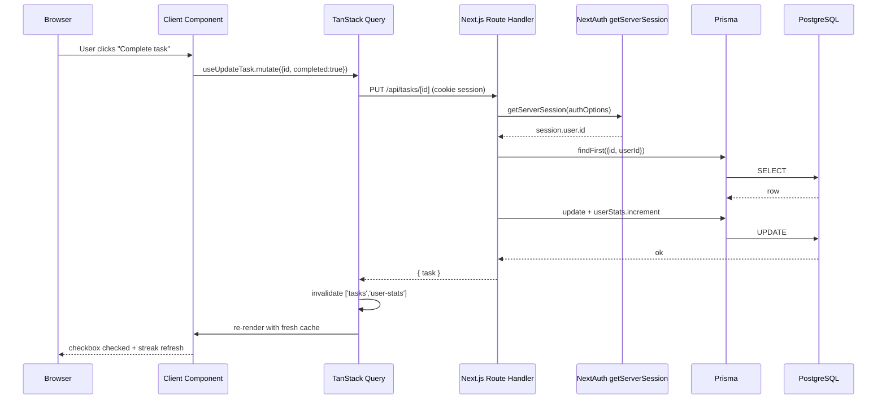
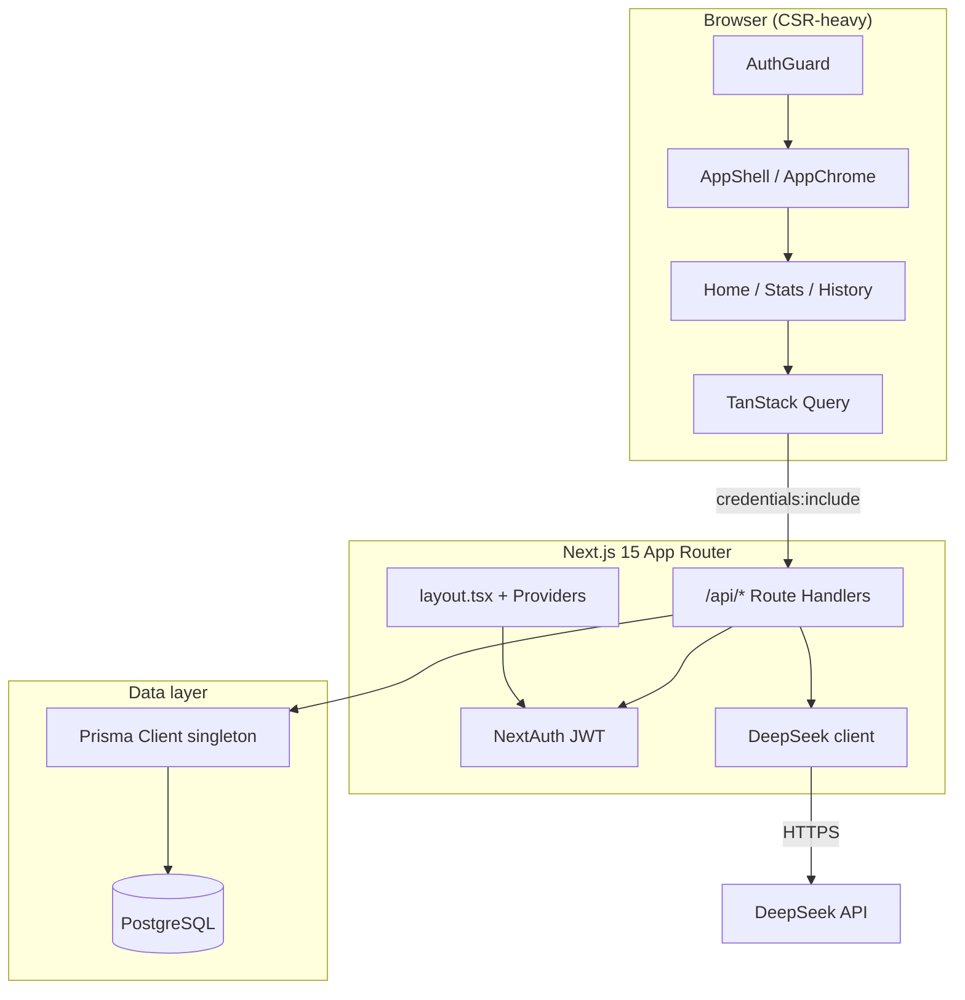
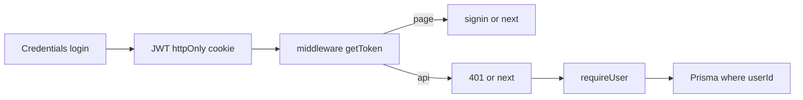
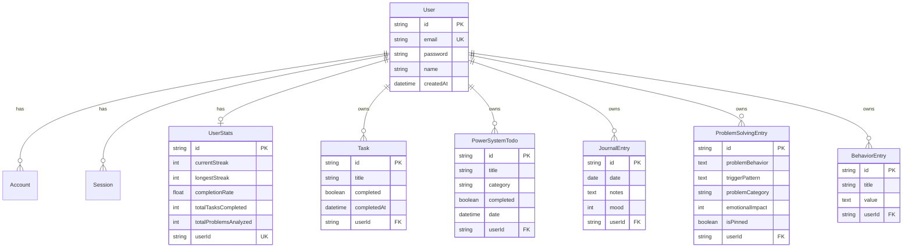
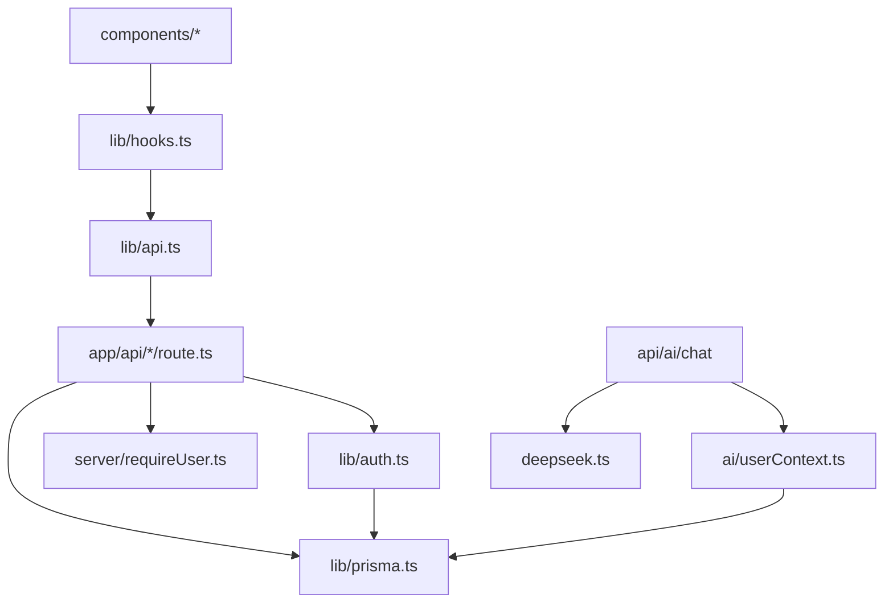

# AttackMode (Habitify) — Principal Engineering Interview Review

**Prepared for:** Juspay-style elimination / deep technical interview  
**Codebase:** Next.js 15 App Router + Prisma/PostgreSQL + NextAuth JWT + TanStack Query + DeepSeek AI  
**LOC (src):** ~9.7k TypeScript/TSX across ~76 source files  
**Review date:** July 2026  

---

## Table of Contents

1. [Part 1 — High Level Overview](#part-1--high-level-overview)
2. [Part 2 — Request Lifecycle](#part-2--request-lifecycle)
3. [Part 3 — Project Architecture](#part-3--project-architecture) → also [`ARCHITECTURE.md`](./ARCHITECTURE.md)
4. [Part 4 — Every Technology](#part-4--every-technology)
5. [Part 5 — Database](#part-5--database)
6. [Part 6 — Authentication](#part-6--authentication)
7. [Part 7 — API Review](#part-7--api-review)
8. [Part 8 — State Management](#part-8--state-management)
9. [Part 9 — Performance](#part-9--performance)
10. [Part 10 — Scalability](#part-10--scalability)
11. [Part 11 — Security](#part-11--security)
12. [Part 12 — Interview Questions (150+)](#part-12--interview-questions-150)
13. [Part 13 — Model Answers](#part-13--model-answers)
14. [Part 14 — Follow-up Questions](#part-14--follow-up-questions)
15. [Part 15 — Low Level Design](#part-15--low-level-design)
16. [Part 16 — Code Review](#part-16--code-review)
17. [Part 17 — Complexity Analysis](#part-17--complexity-analysis)
18. [Part 18 — File-by-File Explanation](#part-18--file-by-file-explanation)
19. [Part 19 — Project Pitch](#part-19--project-pitch)
20. [Part 20 — Juspay Mode (Critical Challenge)](#part-20--juspay-mode-critical-challenge)
21. [Final Score & ROI Fixes](#final-interview-readiness-score)

---

# Part 1 — High Level Overview

## What problem does this project solve?

**AttackMode** is a personal productivity + behavior-change system. It treats productivity as three coupled loops:

1. **Execution** — daily tasks + categorized “Power System” habits (brain / muscle / money)
2. **Reflection** — journal + mood
3. **Pattern correction** — structured problem-solving worksheets + behavior logs
4. **Coaching** — AI coach that reads *your* activity data and answers in context

It is not a generic todo app. The domain model encodes a specific methodology (identity categories + trigger/consequence worksheets).

## Who are the users?

- Single authenticated end-users (B2C personal productivity)
- One user owns all their tasks, habits, journal, problems, behaviors
- No multi-tenant orgs, no roles beyond “logged-in user”
- No shared boards / collaboration

## Core features

| Feature | UI | API | DB model |
|---------|----|-----|----------|
| Auth (credentials) | `/auth/signin`, `/auth/signup` | NextAuth + `/api/auth/signup` | `User`, `Account`, `Session` |
| Daily tasks | `TaskListNew` on `/` | `/api/tasks` | `Task` |
| Power System | `PowerSystem` | `/api/power-system` | `PowerSystemTodo` |
| Journal | `Journal` (`?journal=true`) | `/api/journal` | `JournalEntry` |
| Problem solving | `ProblemSolvingModal` + `/solved-problems` | `/api/problems` | `ProblemSolvingEntry` |
| Behavior log | `SimpleBehaviorModal` + `/behavior-history` | `/api/behaviors` | `BehaviorEntry` |
| Stats / analytics | `/stats` → `StatsDashboard` | `/api/user/stats`, `/api/analytics` | `UserStats` + aggregates |
| AI Coach | `AICoach` slide-over | `/api/ai/chat` | reads many tables via `userContext` |
| Voice widget | OmniDimension script in layout | external | — |

## End-to-end request lifecycle (canonical)



## High-level architecture



## Folder structure (actual)

```
Habitify/
├── prisma/schema.prisma          # Single source of truth for DB
├── src/
│   ├── app/                      # App Router pages + API
│   │   ├── api/                  # 19 route handlers
│   │   ├── auth/                 # signin/signup/error
│   │   ├── page.tsx              # Main dashboard (client)
│   │   ├── stats/, behavior-history/, solved-problems/
│   │   └── layout.tsx            # Fonts, providers, OmniDimension
│   ├── middleware.ts             # NextAuth JWT getToken edge gate
│   ├── components/               # Feature UI + layout + ui kit
│   ├── lib/
│   │   ├── auth.ts               # NextAuth options
│   │   ├── prisma.ts             # Prisma singleton
│   │   ├── api.ts                # Browser fetch wrappers
│   │   ├── hooks.ts              # React Query hooks
│   │   ├── deepseek.ts           # LLM HTTP client
│   │   ├── ai/userContext.ts     # Coach context builder
│   │   └── server/               # requireUser, json helpers
│   └── types/next-auth.d.ts      # Session.user.id typing
├── vectorstore/                  # Orphaned embeddings JSON (unused)
├── scripts/                      # One-off import/test scripts
└── docs/                         # This review
```

## Design philosophy (as implemented)

1. **Monolith BFF** — Next.js owns UI + API; no separate Express service.
2. **User-scoped CRUD** — every row has `userId`; ownership checked before mutate.
3. **JWT sessions** — `session: { strategy: "jwt" }` — no DB session lookup per request for auth.
4. **Client-first rendering** — almost all pages are `'use client'`; Server Components are thin (layout, redirect).
5. **React Query as server-state cache** — no Redux/Zustand for domain data.
6. **Defense in depth for auth** — `src/middleware.ts` (`getToken` JWT check) gates protected pages/APIs at the edge; `AuthGuard` is client UX (session hydration); `getServerSession` / `requireUser` + `userId` filters remain the authorization boundary.
7. **Pragmatic AI** — assemble real DB context → prompt DeepSeek; GET insights are heuristic (no LLM).

---

# Part 2 — Request Lifecycle

> Middleware runs first via `src/middleware.ts` (NextAuth JWT `getToken`). Unauthenticated pages redirect to `/auth/signin`; unauthenticated data APIs return `401 { error: "Unauthorized" }`. Route handlers still call `getServerSession` / `requireUser` and scope Prisma by `userId` (authorization, not just authentication).

## Feature A — Complete a daily task

| Layer | File(s) | What happens |
|-------|---------|--------------|
| Browser | User clicks checkbox in `TaskListNew` | `onToggle(id)` |
| Frontend | `src/app/page.tsx` | `updateTaskMutation.mutate({ id, completed: !task.completed })` |
| Hook | `src/lib/hooks.ts` → `useUpdateTask` | `taskApi.updateTask` then invalidate `['tasks']`, `['user-stats']` |
| API client | `src/lib/api.ts` | `PUT /api/tasks/${id}` with `credentials: 'include'` |
| Middleware | **None** | Cookie sent; no edge auth rewrite |
| Authentication | `src/app/api/tasks/[id]/route.ts` | `getServerSession(authOptions)`; 401 if no `session.user.id` |
| Business logic | same file PUT | Ownership `findFirst({id,userId})`; set `completedAt`; increment/decrement `userStats.totalTasksCompleted` |
| Database | Prisma → PostgreSQL | `UPDATE tasks`; `UPDATE user_stats` |
| Response | `{ task }` 200 | |
| Frontend render | React Query updates cache | `TaskListNew` re-renders progress |
| State update | Invalidation refetch | Home + AppChrome streak may refresh |

## Feature B — Sign up

| Layer | File |
|-------|------|
| UI | `src/app/auth/signup/page.tsx` → `POST /api/auth/signup` |
| API | `src/app/api/auth/signup/route.ts` |
| Auth | Public (no session) |
| Logic | validate → `findUnique(email)` → `bcrypt.hash(12)` → `user.create` → `userStats.create` |
| Response | 201 `{ message, user }` (no password) |
| Next | Navigate to sign-in → credentials login |

## Feature C — Sign in

| Layer | File |
|-------|------|
| UI | `signin/page.tsx` → `signIn("credentials", { email, password, redirect: false })` |
| API | `POST /api/auth/callback/credentials` via `[...nextauth]` |
| Auth config | `src/lib/auth.ts` `authorize()` |
| Logic | `prisma.user.findUnique` → `bcrypt.compare` → return `{id,email,name,image}` |
| JWT | `jwt` callback sets `token.sub = user.id`; `session` callback sets `session.user.id = token.sub` |
| Cookie | NextAuth JWT session cookie (`next-auth.session-token` / `__Secure-` in prod) |
| Frontend | `getSession()` then `router.push("/")` → `AuthGuard` sees session |

## Feature D — Power System create

| Layer | File |
|-------|------|
| UI | `PowerSystem.tsx` → `useCreatePowerSystemTodo` |
| API | `POST /api/power-system` |
| Validation | `title` + `category ∈ {brain,muscle,money}` |
| DB | `powerSystemTodo.create` |
| Cache | invalidate `power-system-todos`, `user-stats` |

## Feature E — Journal upsert-ish create

| Layer | File |
|-------|------|
| UI | `Journal.tsx` |
| API | `POST /api/journal` — if same-day exists → **409**; else create |
| Unique | `@@unique([userId, date])` in schema |
| Update path | `PUT /api/journal/[id]` when entry exists |

## Feature F — AI Coach chat

| Layer | File |
|-------|------|
| UI | `AICoach.tsx` raw `fetch('/api/ai/chat')` (bypasses `api.ts`) |
| Auth | `requireUser()` in `src/lib/server/requireUser.ts` |
| Context | `buildUserActivityContext(userId)` — **10 parallel Prisma queries** |
| Prompt | `buildCoachMessages` + system prompt |
| External | `chatWithDeepSeek` → DeepSeek `/chat/completions` |
| Response | `{ reply, meta: { streak, todayTasks..., averageMood } }` |

## Feature G — Analytics dashboard

| Layer | File |
|-------|------|
| UI | `StatsDashboard.tsx` — `useTasks` + `usePowerSystemTodos` + imperative `fetch('/api/analytics')` |
| API | `GET /api/analytics?timeRange=daily|weekly` |
| Logic | Load range rows → `generateAnalytics` in-memory bucketing |

---

# Part 3 — Project Architecture

> Canonical short version: [`ARCHITECTURE.md`](./ARCHITECTURE.md)

## Standard request path

```text
Browser
  → src/middleware.ts          (JWT authenticate)
  → Page + AuthGuard           (hydration UX only)
  → TanStack Query (hooks.ts)
  → /api route                 (requireUser + jsonOk/jsonError)
  → Prisma (userId-scoped)
  → PostgreSQL
```

## Frontend architecture

- Almost all interactive UI is `'use client'`
- Shell: `AppShell` → `AppChromeProvider` (theme, streak, modals)
- Feature pages compose list/modals; data via `src/lib/hooks.ts`
- **Server state:** TanStack Query — not Redux
- **UI state:** `useState` / chrome context
- Calendar journal/power fetches are **lazy** (only when calendar opens)

## Backend architecture

| Piece | Role |
|-------|------|
| `middleware.ts` | Edge auth (pages redirect, APIs 401) |
| `requireUser()` | Session gate inside every protected handler |
| `jsonOk` / `jsonError` | Uniform JSON responses |
| Route handlers | Validate → Prisma → respond |
| `lib/server/constants.ts` | Shared enums (`POWER_CATEGORIES`) |
| `lib/ai/*` + `deepseek.ts` | Coach context + LLM |

No separate Controllers/Services/Repos tree — handlers stay thin. Extract a service when logic is shared.

## Database architecture

- PostgreSQL via Prisma
- User hub → tasks, power todos, journal, behaviors, problems, userStats
- Ownership: every row has `userId`; cascade delete
- Journal unique `(userId, date)`

## Authentication architecture



## Storage / caching / deployment

| Concern | Choice |
|---------|--------|
| Storage | Postgres only (no Mongo) |
| Client cache | TanStack Query (`staleTime` 60s) |
| Server cache | None yet (Redis = later) |
| Deploy | Next.js on Node (e.g. Vercel); `DATABASE_URL`, `NEXTAUTH_*`, `DEEPSEEK_API_KEY` |

## Configuration & environment variables

See `.env.example`: `DATABASE_URL`, `NEXTAUTH_SECRET`, `NEXTAUTH_URL`, `DEEPSEEK_*`, optional `NEXT_PUBLIC_OMNIDIMENSION_SECRET_KEY`.

## Error handling / logging / monitoring

- Handlers: try/catch → `jsonError(..., 500)` + `console.error`
- No APM yet — add request IDs + structured logs before production load

## Eliminated dumb decisions

| Was | Now |
|-----|-----|
| No middleware / AuthGuard as security | Middleware + requireUser + ownership |
| Copy-pasted `getServerSession` | Single `requireUser()` |
| GET stats wrote streak to DB | GET computes in memory only |
| Profile returned full session | `{ user }` only |
| Eager calendar data on all pages | Fetch when calendar opens |
| mongoose dependency | Removed |
| RQ Devtools always | Dev-only dynamic import |
| Duplicate power update hooks | One hook + alias |

---

# Part 4 — Every Technology

### Next.js 15 (App Router)

| | |
|--|--|
| **Why** | Full-stack TypeScript, file-based API, deploy-friendly |
| **Alternatives** | Remix, Nest+React SPA, Express+Vite |
| **Pros** | Colocated routes, RSC option, Vercel DX |
| **Cons** | Easy to accidentally make everything client; dual runtime complexity |
| **Tradeoff taken** | Used App Router but built a CSR SPA inside it |
| **When NOT** | Heavy background workers, multi-language polyglot services |

### React 19

| | |
|--|--|
| **Why** | UI ecosystem; Next default |
| **Alternatives** | Vue, Svelte, Solid |
| **Tradeoff** | Most pages `'use client'` → larger hydration cost |

### TypeScript

| | |
|--|--|
| **Why** | Shared types across Prisma + API + UI |
| **Weakness** | Frequent `any` in analytics; duplicate domain types in `utils.ts` vs `api.ts` |

### Tailwind CSS v4

| | |
|--|--|
| **Why** | Fast UI iteration; CSS variables for theme |
| **Alternatives** | CSS Modules, shadcn-heavy, styled-components |
| **When NOT** | Design system with strict token compilers / non-utility teams |

### Prisma + PostgreSQL

| | |
|--|--|
| **Why** | Type-safe schema, migrations, relational integrity |
| **Alternatives** | Drizzle, TypeORM, raw SQL, Mongo/Mongoose |
| **Pros** | Indexes/uniques in schema; cascade deletes |
| **Cons** | N+1 if misused; serverless cold connection issues |
| **Mongoose in package.json** | **Dead dependency** — never imported in `src/` |

### NextAuth v4 (Auth.js)

| | |
|--|--|
| **Why** | Credentials + session cookies without custom crypto |
| **Alternatives** | Lucia, Clerk, custom JWT, Auth.js v5 |
| **Tradeoff** | JWT strategy = no server-side session revoke without denylist |
| **Prisma adapter installed** | `@auth/prisma-adapter` present but credentials JWT path doesn’t use DB sessions |

### bcryptjs

| | |
|--|--|
| **Why** | Password hashing, cost 12 |
| **Alternatives** | argon2, scrypt |
| **Tradeoff** | bcryptjs (JS) slower than native bcrypt; fine at low QPS |

### TanStack Query v5

| | |
|--|--|
| **Why** | Cache, invalidation, loading/error for CRUD |
| **Alternatives** | SWR, RTK Query, RSC + server actions |
| **Pros** | Clear keys; mutation → invalidate pattern |
| **Cons** | Duplicate fetches when keys differ (`power-system` with/without date) |

### Recharts

| | |
|--|--|
| **Why** | Stats charts |
| **Cons** | Large client bundle on `/stats` |

### DeepSeek API

| | |
|--|--|
| **Why** | Cheap OpenAI-compatible chat for coach |
| **Alternatives** | OpenAI, Claude, local Ollama |
| **Risk** | No rate limit → cost abuse; dependency on third party |

### date-fns / lucide-react / clsx / tailwind-merge

Utility choices; low controversy. `cn()` in `utils.ts` merges class names.

### Technologies listed but NOT used

| Tech | Status |
|------|--------|
| Mongoose / MongoDB | Dependency + env comment only |
| Redis | Absent |
| Socket.io | Absent |
| OpenAI embeddings / vectorstore | Orphan JSON + env; no code path |
| Next.js middleware | `src/middleware.ts` — JWT `getToken`; pages redirect, APIs 401 |

---

# Part 5 — Database

## ER diagram



## Model deep dive

### User
- **Purpose:** Identity + credential store
- **PK:** `id` cuid
- **Unique:** `email`
- **Relations:** all domain tables + NextAuth Account/Session
- **Query patterns:** `findUnique({email})` login/signup; `findUnique({id})` profile
- **Bottleneck:** email unique lookup is fine; password verify is CPU-bound
- **Scale:** Add OAuth accounts later via `Account`

### Account / Session / VerificationToken
- NextAuth adapter tables
- **With JWT strategy:** Session rows generally unused for credentials login
- **Risk:** Schema implies DB sessions; interviewers will ask why both exist

### Task
- **Indexes:** `@@index([userId, completed])`
- **Patterns:** list all by user ordered `createdAt desc`; update completion; stats increment
- **Normalization:** fine; “today’s tasks” filtered in **app** by `createdAt` day — not a `date` column (design smell)
- **Bottleneck:** GET returns **all** tasks ever — no pagination

### PowerSystemTodo
- **Indexes:** `(userId, date)`, `(userId, category)`
- **Category:** string, not enum in DB — app validates on create only
- **Patterns:** filter by day range for streaks/stats
- **Scale:** per-user daily rows grow linearly; archive old days later

### JournalEntry
- **Unique:** `@@unique([userId, date])` — one entry per day
- **Mood:** Int default 5 — **no DB CHECK** for 1–10
- **Patterns:** get by date; list recent with `take`

### ProblemSolvingEntry
- Large text worksheet fields
- **Indexes:** `(userId, isPinned)`, `(userId, problemCategory)`
- **Patterns:** list, pin, AI context takes pinned(5)+recent(8)

### BehaviorEntry
- Append-only from API (no update/delete routes)
- **Index:** `(userId, createdAt)`
- **Bottleneck:** unbounded growth; no purge

### UserStats
- **1:1** with User (`userId` unique)
- **Denormalized counters** + streak fields
- **Inconsistency risk:** counters updated on task/problem mutate; streak **recomputed on GET `/api/user/stats`** from last 60 days of activity
- **Race:** concurrent complete/uncomplete can race increment/decrement (no transaction)

## Normalization notes

- Mostly 3NF
- `UserStats` is intentional denormalization
- `category` as free string vs enum table — denormalized vocabulary
- Task “daily” semantics derived from timestamp — weaker than explicit `date` column like Power System / Journal

## Future scalability

1. Paginate all list endpoints
2. Partition/archive old `behavior_entries` / completed tasks
3. Materialized daily activity table for streaks (avoid 60-day scan on every stats GET)
4. Read replica for analytics
5. Consider enum types / CHECK constraints in Postgres

---

# Part 6 — Authentication

## How login works (exact)

1. Client: `signIn("credentials", { email, password, redirect: false })`
2. NextAuth invokes `CredentialsProvider.authorize` in `src/lib/auth.ts`
3. Load user by email; if no password → `null` (failed login)
4. `bcrypt.compare(password, user.password)`
5. Return user object → JWT created; `jwt` callback: `token.sub = user.id`
6. `session` callback: `session.user.id = token.sub`
7. Cookie set; client redirects to `/`

## How logout works

- UI: `signOut()` from `next-auth/react` (TopBar)
- Clears session cookie; client becomes unauthenticated; AuthGuard redirects

## JWT lifecycle

- Strategy: `"jwt"` in `authOptions.session`
- Claims: standard NextAuth + `sub` = user id
- Typed in `src/types/next-auth.d.ts` (`Session.user.id`, JWT `uid` declared but code uses `sub`)
- **No custom `maxAge` / rotation** in code — defaults apply
- **No refresh token endpoint** — cookie JWT is the session

## Session lifecycle

- Client: `SessionProvider` → `useSession`
- Server: `getServerSession(authOptions)` decrypts/verifies JWT from cookie
- DB `sessions` table **not** consulted under JWT strategy

## Cookies

- HTTP-only session cookie managed by NextAuth
- `credentials: 'include'` on API client so browser sends cookie cross-same-origin
- CSRF: NextAuth uses its CSRF token for its POSTs; custom API routes rely on **same-site cookie** model (no extra CSRF token)

## Middleware

- **File:** `src/middleware.ts` — NextAuth JWT via `getToken`
- **Authorized when:** JWT has `token.sub` (user id)
- **Matcher:** `/`, `/dashboard`, `/stats`, `/behavior-history`, `/solved-problems`, and data APIs (`/api/tasks`, `/power-system`, `/journal`, `/behaviors`, `/problems`, `/user`, `/analytics`, `/ai`)
- **Public (not matched):** `/auth/*`, `/api/auth/*` (incl. signup), `/api/test`, `/api/debug/*`, `/interview-prep.html`, `/docs/*`, static assets
- **Pages:** unauthenticated → `307` redirect `/auth/signin?callbackUrl=…`
- **APIs:** unauthenticated → `401 { error: "Unauthorized" }`
- **Still required in handlers:** `getServerSession` / `requireUser` + `userId` filters (middleware authenticates; handlers authorize)
- **Not in middleware yet:** rate limiting, request-id injection (roadmap)

## Authorization

- Model: **resource ownership** — `where: { id, userId: session.user.id }`
- No RBAC / roles
- IDOR mitigated if handlers always use `findFirst` with userId (they generally do before mutate)

## Protected routes

| Surface | Protection |
|---------|------------|
| `/`, `/stats`, `/behavior-history`, `/solved-problems`, `/dashboard` | `middleware.ts` redirect + `AuthGuard` session-hydration UX |
| `/api/tasks`, `/power-system`, `/journal`, … | `middleware.ts` 401 + `getServerSession` / `requireUser` + `userId` |
| `/api/auth/signup` | public |
| `/api/test` | public always |
| `/interview-prep.html`, `/docs/*` | public study surface |
| `/api/debug/session`, `create-test-user` | public in non-production |

## Refresh tokens

- Not implemented as a separate artifact
- Interview answer: “We use NextAuth JWT session cookies; renewal is NextAuth’s session update, not a custom refresh token store.”

## Security considerations & vulnerabilities

1. Middleware + API session checks = defense in depth; **AuthGuard alone was never the boundary** (now UX-only)
2. JWT cannot be revoked server-side without denylist / short expiry / sessionVersion
3. Password min length 6
4. No email verification
5. No rate limit on login/signup → brute force / spam
6. Timing: returning null for missing user vs bad password is similar (good), but still no lockout
7. `NEXT_PUBLIC_OMNIDIMENSION_SECRET_KEY` exposed
8. Debug endpoints if `NODE_ENV` mis-set in prod

---

# Part 7 — API Review

## Matrix

| Endpoint | Auth | Purpose | Validation | DB ops | Failure modes | Idempotency | Rate limit |
|----------|------|---------|------------|--------|---------------|-------------|------------|
| `GET /api/test` | No | Health | — | none | none | Yes | No |
| `GET /api/debug/session` | No (404 prod) | Debug session | — | none | 500 | Yes | No |
| `POST /api/auth/create-test-user` | No (404 prod) | Seed user | weak | user+stats | 500 | No (creates) | No |
| `POST /api/auth/signup` | No | Register | name/email/pw≥6 | user+stats | 400/409/500 | No | No |
| `POST /api/auth/register` | No | Alias signup | same | same | same | No | No |
| `GET/POST /api/auth/[...nextauth]` | NextAuth | Login/session | provider | user read | Auth errors | Login no | No |
| `GET /api/tasks` | Yes | List all tasks | — | findMany | 401/500 | Yes | No |
| `POST /api/tasks` | Yes | Create | title required | create | 400/404/500 | No | No |
| `GET/PUT/DELETE /api/tasks/[id]` | Yes | CRUD one | ownership | find/update/delete + stats | 401/404/500 | DELETE yes; PUT conditional | No |
| `GET/POST /api/power-system` | Yes | List/create | category enum on POST | findMany/create | 400/401/500 | GET yes | No |
| `PUT/DELETE /api/power-system/[id]` | Yes | Update/delete | category **not** revalidated | update/delete | 401/404/500 | DELETE yes | No |
| `GET/POST /api/journal` | Yes | List/create | mood unchecked; unique day | findMany/create | 409/401/500 | GET yes | No |
| `GET/PUT/DELETE /api/journal/[id]` | Yes | CRUD | ownership | … | 401/404/500 | DELETE yes | No |
| `GET/POST /api/behaviors` | Yes | List/create | title+value | findMany/create | 400/401/500 | GET yes | No |
| `GET/POST /api/problems` | Yes | List/create | 2 required fields | create + stats upsert | 400/401/500 | GET yes | No |
| `GET/PUT/DELETE /api/problems/[id]` | Yes | CRUD | `\|\|` empty-string bug | update/delete + decrement | 401/404/500 | DELETE yes | No |
| `GET /api/user/profile` | Yes | Profile | — | user+stats | returns **full session** | Yes | No |
| `GET /api/user/stats` | Yes | Streak + categories | — | many finds + **write** | 401/500 | **Not pure GET** | No |
| `GET /api/analytics` | Yes | Charts | timeRange | findMany + in-memory | 401/500 | Yes | No |
| `POST /api/ai/chat` | Yes | Coach reply | msg ≤4000 | 10 queries + LLM | 400/401/503/500 | No | No |
| `GET /api/ai/chat` | Yes | Heuristic insight | — | context queries | soft 200 | Yes | No |

### Complexity highlights

- **`GET /api/user/stats`:** O(T + P) over 60 days activity + 3 range queries; mutates stats — interviewer magnet
- **`POST /api/ai/chat`:** O(constant queries) + external latency; cost/risk magnet
- **`GET /api/tasks`:** O(n) all tasks — scales poorly per user
- **`GET /api/analytics`:** O(n × days) nested filters in JS

### How an interviewer may question an endpoint (examples)

**Tasks PUT:** “Two tabs complete the same task — what happens to `totalTasksCompleted`?”  
→ No transaction; both may see `!existingTask.completed` and double-increment.

**Journal POST:** “Why 409 instead of upsert?”  
→ Explicit conflict; unique constraint backup; client must PUT.

**User stats GET:** “Why does a GET write?”  
→ Lazy reconciliation of streak; wrong purity for caches/CDN.

**AI chat:** “How do you stop a user from spending your DeepSeek budget?”  
→ Today: you don’t (no rate limit / quota).

---

# Part 8 — State Management

## React state

- Forms, modals, edit mode, filters: `useState`
- Theme + chrome: `AppChromeContext`
- No Redux/Zustand

## Server state

- TanStack Query keys: `tasks`, `power-system-todos`(+params), `journal-entries`, `problems`, `behaviors`, `user-stats`, `user-profile`
- Mutations invalidate related keys

## Caching / hydration / SSR / CSR

| Concern | Reality |
|---------|---------|
| SSR data for dashboard | **No** — client fetch after hydrate |
| RSC | layout fonts/metadata only |
| Hydration | AuthGuard spinner → then Query fetches |
| Prefetch | None server-side |

## Client vs Server Components

- **Server:** `layout.tsx`, `dashboard/page.tsx` (redirect), API routes, lib server modules
- **Client:** virtually all UI

## Rendering lifecycle (home)

1. Server render layout shell
2. Client hydrate Providers + page
3. `useSession` loading → AuthGuard spinner
4. Session ok → AppShell mounts → AppChrome queries fire
5. Home queries fire (some duplicate)
6. UI paints with data

---

# Part 9 — Performance

| Issue | Evidence | Fix |
|-------|----------|-----|
| Duplicate power-system fetches | AppChrome `usePowerSystemTodos()` vs Home with `{date}` — different keys | Unify key or pass props only |
| Eager journal(60) | AppChrome always | Fetch when Calendar opens |
| Unbounded task list | `GET /api/tasks` all rows | Paginate / filter by date server-side |
| Stats GET heavy | 5+ queries + streak recompute + write | Cache streak; move write off GET |
| AI context fan-out | 10 parallel queries per chat | Cache context 30–60s per user |
| Large dead code | `SolvedProblemsModal` 540 lines unused; mock data in `utils.ts` | Delete |
| Recharts on stats | Large JS | dynamic `import()` |
| React Query Devtools always | `Providers.tsx` | Dev-only import |
| No optimistic toggles | Wait for mutate | `onMutate` optimistic |
| Auth → data waterfall | AuthGuard then queries | middleware + RSC prefetch |

### Index opportunities

- Task: `(userId, createdAt)` for “today” queries if moved server-side
- Composite already good for power system date filters
- Stats streak: daily activity summary table with PK `(userId, date)`

---

# Part 10 — Scalability

| Users | What breaks first | Mitigation |
|-------|-------------------|------------|
| **100** | Fine on single Node + small PG | Basic monitoring |
| **10k** | AI cost + unbounded lists; bcrypt on shared CPU | Rate limit AI/auth; paginate; connection pool |
| **100k** | Stats GET write amplification; multi-instance Prisma connections | PgBouncer; cache stats; stop GET mutations; CDN static |
| **1M** | Single region PG; no queue for AI; JWT secret rotation ops | Read replicas; AI job queue; Redis rate limits; horizontal Next instances |
| **10M** | Multi-tenant product limits; shard by userId; separate analytics OLAP | Shard/partition; Kafka/SQS; dedicated auth service |

### Scaling levers mapped to this codebase

| Lever | Fit |
|-------|-----|
| Horizontal Next.js | Good (stateless JWT) |
| Vertical PG | Easy early win |
| Read replicas | Analytics + AI context reads |
| Sharding | By `userId` hash later |
| Queues | AI chat, streak recompute, emails |
| Redis | Session denylist, rate limit, stats cache |
| CDN | Static `_next/static`; not personalized API |
| Load balancer | Multiple `next start` / serverless |

**What breaks first in *this* design:** `/api/ai/chat` cost + `/api/user/stats` compute + full-table task downloads — not CPU of React.

---

# Part 11 — Security

| Finding | Severity | Fix |
|---------|----------|-----|
| No rate limiting (signup/login/AI) | High | Edge rate limit / Redis token bucket |
| `NEXT_PUBLIC_OMNIDIMENSION_SECRET_KEY` | High | Proxy widget config server-side; don’t use “secret” in public env |
| Client AuthGuard (UX only) | Low | Middleware is the page gate; AuthGuard hydrates session |
| `/api/test` public | Low–Med | Prod gate or remove |
| Debug/test-user if NODE_ENV wrong | High | Separate `ENABLE_DEBUG` flag |
| PII `console.log` session on tasks | Medium | Structured logs, redact |
| Profile returns full `session` | Medium | Return user DTO only |
| Weak password policy | Medium | Length 12+, breach check optional |
| No CSRF token on custom APIs | Medium | SameSite=Lax/Strict + Origin check |
| Unbounded text fields | Medium | Max length validation |
| SQL injection | Low | Prisma parameterized |
| NoSQL injection | N/A | Mongo unused |
| XSS | Low | React text escaping; avoid `dangerouslySetInnerHTML` |
| Stats counter races | Medium | Transactions / conditional updates |
| Secrets in README historically | High if real keys committed | Rotate; scrub git |
| Vectorstore user JSON in repo | Medium | Gitignore; delete PII embeddings |
| File upload | N/A | None today |

---

# Part 12 — Interview Questions (150+)

## A. Architecture (1–20)

1. What does AttackMode do that a normal todo app doesn’t?
2. Why is this a monolith instead of separate frontend/backend?
3. Why Next.js App Router if almost everything is client-rendered?
4. Where is the trust boundary in your system?
5. How does `middleware.ts` work with AuthGuard?
6. How does a request flow from checkbox click to PostgreSQL?
7. What is your design philosophy in one sentence?
8. Which components are Server Components and why so few?
9. How would you split this into microservices later?
10. What is the BFF pattern and do you use it?
11. Why colocate API routes under `/app/api`?
12. What fails if the DeepSeek API is down?
13. How do you version your API?
14. What’s the difference between your README architecture and the code?
15. Why was mongoose removed?
16. What is the vectorstore folder for?
17. How do you handle multi-device sync?
18. Where would you put background jobs?
19. How is configuration injected?
20. What would you open-source vs keep private?

## B. Backend (21–40)

21. How are route handlers structured?
22. Why duplicate `getServerSession` instead of always using `requireUser`?
23. How do you validate request bodies?
24. Why no Zod?
25. How does ownership check prevent IDOR?
26. What status codes do you use and when?
27. Why does journal create return 409?
28. Why can `GET /api/user/stats` write to the DB?
29. How do you update `totalTasksCompleted`?
30. What happens if `userStats` row is missing on task complete?
31. How does analytics aggregation work?
32. What’s wrong with unbounded `limit` query params?
33. How would you add pagination?
34. How do you handle partial failures in task complete + stats update?
35. Should those be one transaction?
36. How does AI context building work?
37. Why parallel `Promise.all` in `userContext`?
38. How do you truncate chat history?
39. Why return 503 for missing API key?
40. How would you make endpoints idempotent?

## C. Frontend (41–55)

41. How does AuthGuard work?
42. What is AppChrome responsible for?
43. Why React Query over Context for tasks?
44. Explain your query key design.
45. Why do Home and AppChrome double-fetch power todos?
46. How does dark mode persist?
47. Why is AICoach not using `api.ts`?
48. How does Journal decide create vs update?
49. What’s the Power System UI model?
50. How do you avoid re-rendering all todos?
51. Why is StatsDashboard so large?
52. How would you code-split charts?
53. What is the mobile nav IA?
54. How do you handle mutation errors in UI?
55. What’s wrong with shipping React Query Devtools?

## D. Database (56–75)

56. Why PostgreSQL over MongoDB?
57. Walk through the Prisma schema.
58. Why cuid instead of UUID/serial?
59. Why cascade deletes?
60. Explain `JournalEntry` unique `(userId, date)`.
61. Why is Power System `category` a string?
62. What indexes exist and why?
63. How is streak stored vs computed?
64. Is `UserStats` normalized?
65. What query is hardest on the DB today?
66. How would you paginate tasks efficiently?
67. What happens to orphaned rows if you remove cascade?
68. Why both Account and password on User?
69. How would you migrate to enum types?
70. When do you need a daily_activity table?
71. How do you backfill streaks?
72. What’s your migration strategy (`db push` vs migrate)?
73. How does Prisma singleton avoid hot-reload leaks?
74. Connection pooling on serverless?
75. How would you shard by userId?

## E. Authentication (76–95)

76. Explain credentials login end-to-end.
77. Why JWT session strategy?
78. Tradeoffs vs database sessions?
79. How is `session.user.id` populated?
80. Why does `next-auth.d.ts` declare `uid` if you use `sub`?
81. How are passwords stored?
82. Why bcrypt cost 12?
83. Why argon2 might be better?
84. How does logout work?
85. Can you revoke a JWT immediately?
86. What is AuthGuard not protecting?
87. How would middleware improve security?
88. CSRF risks on cookie auth?
89. XSS stealing session?
90. Brute force login defense?
91. Why no email verification?
92. OAuth — why documented but not coded?
93. Is `@auth/prisma-adapter` used?
94. What’s in the session cookie?
95. How do you rotate `NEXTAUTH_SECRET`?

## F. Deployment / Ops (96–105)

96. How do you deploy this?
97. What env vars are required in prod?
98. What happens if `NEXTAUTH_URL` is wrong?
99. Health check strategy?
100. How do you run migrations in CI?
101. Zero-downtime deploy concerns with Prisma?
102. Logging strategy today?
103. How would you add Sentry?
104. Secrets management?
105. Why empty `next.config.ts` is a problem?

## G. Caching (106–115)

106. What is cached today?
107. Why not Redis?
108. Where would Redis help first?
109. React Query staleTime meaning?
110. Cache invalidation on task complete?
111. Can you CDN cache `/api/user/stats`?
112. Prisma Accelerate — when?
113. HTTP cache headers?
114. Stale-while-revalidate for AI insights?
115. Cache stampede on stats?

## H. Scalability (116–125)

116. What breaks at 10k users?
117. Horizontal scaling story?
118. Sticky sessions needed?
119. AI queue design?
120. Read replica routing?
121. Rate limit placement (edge vs app)?
122. Multi-region data?
123. Fan-out on AI context at scale?
124. How to cap per-user storage?
125. Cost model for LLM features?

## I. Performance (126–135)

126. Biggest frontend perf issue?
127. Biggest backend perf issue?
128. How to measure?
129. N+1 risks?
130. Bundle size risks?
131. Optimistic UI for toggles?
132. Virtualize long lists?
133. Server-side “today tasks” filter?
134. Avoid GET-with-write?
135. Memoization — when it matters here?

## J. Security (136–150)

136. XSS vectors?
137. CSRF?
138. SQL injection?
139. IDOR test plan?
140. Secret in `NEXT_PUBLIC_`?
141. Rate limiting AI?
142. Password policy?
143. Debug endpoints in prod?
144. Logging PII?
145. Dependency risk (mongoose unused)?
146. Security headers?
147. Content Security Policy?
148. Threat model for a personal productivity app?
149. How to store OmniDimension securely?
150. Abuse case: signup spam?

## K. Tradeoffs / Failure / Concurrency (151–165)

151. Why not Express?
152. Why not Redis today?
153. Why not PostgreSQL enums?
154. Why JWT not server sessions?
155. Tradeoff of client-heavy Next app?
156. What if Postgres is down mid-request?
157. What if DeepSeek times out?
158. Two devices complete same task?
159. Cache inconsistent with DB?
160. Partial failure task updated stats not?
161. Clock skew on “today”?
162. Timezone bugs in streak?
163. Duplicate journal insert race?
164. How would you test concurrency?
165. What’s your biggest architectural regret?

---

# Part 13 — Model Answers

> Speak like a strong candidate: concrete, reference files, admit gaps, propose fixes.

### Q1 — What does AttackMode do that a normal todo app doesn’t?
“It’s built around an identity framework and behavior change, not just task lists. We have Power System categories (brain/muscle/money) in `PowerSystemTodo`, structured problem worksheets in `ProblemSolvingEntry` with triggers/consequences/preferred behaviors, mood journaling with a per-day unique constraint, and an AI coach in `/api/ai/chat` that pulls live user context via `buildUserActivityContext` rather than chatting generically.”

### Q2 — Why monolith Next.js?
“For a single-product personal app, colocating UI and Route Handlers cut coordination cost. Prisma and NextAuth run in the same Node process. I’d split workers (AI, analytics) out first under load—not the CRUD API.”

### Q5 — Why middleware + AuthGuard + getServerSession?
“Defense in depth. `src/middleware.ts` uses NextAuth `getToken` to reject unauthenticated page/API traffic at the edge (pages → redirect, APIs → 401 JSON). `AuthGuard` only waits for client session hydration so the UI doesn’t flash. Route handlers still call `getServerSession` / `requireUser` and filter by `userId` — middleware authenticates; handlers authorize.”

### Q28 — GET stats writes?
“`GET /api/user/stats` recomputes streak from 60 days of completions and updates `UserStats` if changed. It’s convenient for always-fresh streaks but violates GET purity—bad for caching and surprising under GET retries. I’d move recompute to a mutation path or cron and make GET read-only.”

### Q35 — Transaction for task + stats?
“Today PUT updates task then increments stats separately. If the second fails, counters drift. I’d wrap in `prisma.$transaction`. For concurrency, use conditional update: only increment if row still incomplete.”

### Q45 — Double fetch?
“AppChrome calls `usePowerSystemTodos()` with no date; Home calls it with today’s date. Different query keys → two network requests. Fix: one fetch in chrome and pass props, or standardize keys.”

### Q56 — Why Postgres?
“Relational integrity matters: user-owned rows, unique journal per day, cascades. Prisma + Postgres. Early Mongo experiments left a `mongoose` dependency — we removed it so the story matches the code.”

### Q77 — Why JWT strategy?
“Avoids a DB round-trip on every API call for session lookup. Tradeoff: logout is cookie clear only; stolen JWT valid until expiry unless we add a denylist in Redis.”

### Q116 — What breaks at 10k?
“Not React—`/api/ai/chat` cost and latency, unbounded `GET /api/tasks`, and bcrypt/AI CPU. I’d rate-limit, paginate, and queue LLM calls.”

### Q140 — NEXT_PUBLIC secret?
“Anything `NEXT_PUBLIC_` is shipped to the browser. Putting OmniDimension’s secret there means it’s not a secret. I’d load the widget via a server-issued short-lived token or a non-secret public site key.”

### Q158 — Two devices same task?
“Both read `completed: false`, both increment. Classic lost race. Fix: transaction with `updateMany({ where: { id, userId, completed: false }, data: { completed: true } })` and increment only if `count === 1`.”

### Q163 — Duplicate journal race?
“Unique `(userId, date)` makes one insert win; other gets Prisma unique violation → should map to 409. App also pre-checks `findFirst`—TOCTOU race possible; unique constraint is the real guard.”

---

## Full model answers (Q3–Q165)

### Architecture continued

**Q3 — Why App Router if CSR?**  
“I wanted file-based API routes next to pages and future RSC optionality. In practice the product UI needed hooks (`useSession`, React Query, modals), so pages are client components. That’s a valid intermediate state—but I’d move data fetching for the dashboard into Server Components or route loaders next to cut the auth→fetch waterfall.”

**Q4 — Trust boundary?**  
“The browser is untrusted. `AuthGuard` is not the boundary. `getServerSession` + `userId` filters in Route Handlers are. Postgres trusts the app via connection string, not end users.”

**Q6 — Checkbox to Postgres?**  
“`page.tsx` → `useUpdateTask` → `taskApi.updateTask` → `PUT /api/tasks/[id]` → `getServerSession` → `findFirst({id,userId})` → `task.update` → maybe `userStats.update` → JSON → React Query invalidate → re-render.”

**Q7 — Philosophy one sentence?**  
“User-scoped productivity domain in a Next BFF with JWT sessions and React Query for server state.”

**Q8 — Few Server Components?**  
“Only `layout.tsx` and the dashboard redirect. Everything interactive opted into client. Cost: larger JS and delayed data.”

**Q9 — Microservices later?**  
“Extract (1) AI worker + queue, (2) analytics read service, keep CRUD monolith until pain is real.”

**Q10 — BFF?**  
“Yes—browser only talks to same-origin `/api/*`, which aggregates Prisma and DeepSeek.”

**Q11 — Colocate API?**  
“Shared TypeScript types, one deploy unit, simple auth cookie story.”

**Q12 — DeepSeek down?**  
“POST `/api/ai/chat` returns 500/503; GET insights can still return heuristic text from DB context. Core CRUD unaffected.”

**Q13 — API versioning?**  
“None today. I’d add `/api/v1` when breaking changes ship, or header versioning.”

**Q14 — README vs code?**  
“README claims OAuth providers and deep OmniDimension data integration; code has credentials-only NextAuth and a client script tag. Mongoose is unused.”

**Q15 — Mongoose?**  
“Legacy dependency. Remove it—Postgres/Prisma is the source of truth.”

**Q16 — Vectorstore?**  
“Orphan JSON embeddings; no importer in `src/`. Dead RAG experiment.”

**Q17 — Multi-device sync?**  
“Same user JWT on each device; React Query refetch. No realtime (no websockets). Last-write-wins on fields.”

**Q18 — Background jobs?**  
“Not present. I’d add a queue worker for streak recompute, AI, emails—BullMQ/Redis or a cloud queue.”

**Q19 — Configuration?**  
“Env vars via `.env.local` / host; read in server modules (`process.env`). Public only if `NEXT_PUBLIC_`.”

**Q20 — Open source vs private?**  
“Open UI patterns; keep secrets, prompts tuned on private data, and any paid API keys private.”

### Backend

**Q21 — Route handler structure?**  
“Each `route.ts` exports HTTP verbs; try/catch; session check; validate; Prisma; JSON status.”

**Q22 — Duplicate session checks?**  
“Historical. `requireUser` exists but only AI uses it. I’d standardize.”

**Q23–24 — Validation / Zod?**  
“Ad-hoc `if (!title)` checks. No Zod. I’d add Zod schemas per route for length, enums, mood ranges.”

**Q25 — IDOR?**  
“Mutations `findFirst({ id, userId })` before update/delete. Guessing another user’s id returns 404.”

**Q26 — Status codes?**  
“200/201 success, 400 validation, 401 auth, 404 missing/forbidden-as-not-found, 409 journal conflict, 500 generic, 503 AI misconfig.”

**Q27 — Journal 409?**  
“One entry per day (`@@unique`). Create refuses duplicates; client should PUT.”

**Q29 — totalTasksCompleted?**  
“On PUT, if newly completed → increment; if uncompleted → decrement; on DELETE of completed → decrement.”

**Q30 — Missing userStats on complete?**  
“`userStats.update` throws → 500. Signup creates stats; create-test-user too; but not guaranteed for all legacy users. Prefer `upsert`.”

**Q31 — Analytics?**  
“Load tasks + power todos in range; `generateAnalytics` buckets by day/week in JS; returns chart series + totals.”

**Q32 — Unbounded limit?**  
“Client can `?limit=999999` and stress memory. Cap server-side (e.g. max 100).”

**Q33 — Pagination?**  
“Cursor on `createdAt,id` or offset; return `{ items, nextCursor }`.”

**Q34–35 — Partial failure / transaction?**  
“Two writes without `$transaction`. Use transaction; ideally conditional update for idempotent complete.”

**Q36–38 — AI context / Promise.all / history?**  
“`buildUserActivityContext` parallel reads user, stats, tasks, power, journal, behaviors, problems. History filtered to user/assistant, trimmed to 4000 chars, last 12 in prompt builder.”

**Q39 — 503 for API key?**  
“Distinguishes operator misconfiguration from model errors—client can show ‘AI unavailable’.”

**Q40 — Idempotency?**  
“GET/DELETE mostly; POST create not idempotent. Add `Idempotency-Key` for creates; conditional completes.”

### Frontend

**Q41 — AuthGuard?**  
“UX after `middleware.ts`: spinner while `useSession` hydrates. Middleware already redirected unauthenticated page traffic. AuthGuard is not the security boundary.”

**Q42 — AppChrome?**  
“Theme, streak, sidebar, modal openers; mounts global modals. Fetches stats for streak; journal/power load only when calendar opens.”

**Q43 — React Query vs Context?**  
“Server cache with stale/invalidate beats shoving async lists into Context.”

**Q44 — Query keys?**  
“Stable roots like `['tasks']`; parameterized `['power-system-todos', params]`. Mutations invalidate roots.”

**Q46 — Dark mode?**  
“`localStorage('am-theme')` + toggle `dark` class on `documentElement`.”

**Q47 — AICoach bypass api.ts?**  
“Direct fetch; inconsistency. Should use shared client for errors/credentials.”

**Q48 — Journal create vs update?**  
“Fetch by date; if entry exists update via id; else POST (409 if race).”

**Q49 — Power System UI?**  
“Three columns/sections by category; progress from stats; items memoized in `PowerSystemTodoItem`.”

**Q50 — Avoid re-renders?**  
“Memoized item component with custom comparator; still parent-level churn from query updates.”

**Q51 — StatsDashboard large?**  
“Charts + fallback aggregation + multiple data sources in one file—should split containers/presenters.”

**Q52 — Code-split charts?**  
“`next/dynamic` import Recharts pieces with `ssr: false`.”

**Q53 — Mobile nav IA?**  
“Today / Journal / Track / Coach / Solve — mirrors capture vs review loops.”

**Q54 — Mutation errors?**  
“Throw from `apiRequest`; components variously log or ignore—error UX is uneven.”

**Q55 — Devtools in prod?**  
“Always imported in `Providers.tsx`. Gate with `process.env.NODE_ENV === 'development'`.”

### Database

**Q57 — Schema walkthrough?**  
“User hub; NextAuth Account/Session/VerificationToken; Task; PowerSystemTodo; JournalEntry unique per day; ProblemSolvingEntry worksheet; BehaviorEntry append log; UserStats 1:1 aggregates.”

**Q58 — cuid?**  
“Prisma default string ids—sortable-ish, no central sequence. UUID also fine.”

**Q59 — Cascade?**  
“Deleting user removes owned rows—correct for personal accounts GDPR delete.”

**Q60 — Journal unique?**  
“Enforces one reflection/day; API pre-check + DB constraint.”

**Q61 — Category string?**  
“Flexibility; weaker integrity. Prefer Prisma enum / PG enum.”

**Q62 — Indexes?**  
“`(userId,completed)` tasks; `(userId,date)`/`(userId,category)` power; `(userId,isPinned)`/`problemCategory` problems; `(userId,createdAt)` behaviors.”

**Q63 — Streak stored vs computed?**  
“Stored on UserStats; recomputed from 60-day activity on stats GET; longestStreak = max(stored, current).”

**Q64 — UserStats normalized?**  
“No—denormalized counters/rates for read speed; must stay consistent via writes.”

**Q65 — Hardest query?**  
“Stats streak lookback + multiple power ranges; AI context fan-out; analytics nested filters.”

**Q66 — Paginate tasks?**  
“`where: { userId, createdAt: { gte: day } }` + `take/cursor`.”

**Q67 — Remove cascade?**  
“Orphans or FK violations on user delete—need manual cleanup.”

**Q68 — Account + password?**  
“Password for credentials; Account for future OAuth. Only credentials wired.”

**Q69 — Enum migration?**  
“Prisma enum → migrate; backfill invalid categories first.”

**Q70 — daily_activity table?**  
“When streak/analytics scans dominate—upsert `(userId,date)` on any completion.”

**Q71 — Backfill streaks?**  
“Batch job scan historical completions → write UserStats.”

**Q72 — db push vs migrate?**  
“`push` for proto; `migrate` for prod history. Prefer migrate in team/prod.”

**Q73 — Prisma singleton?**  
“Store on `globalThis` in dev to survive HMR; avoid connection storms.”

**Q74 — Serverless pooling?**  
“Use PgBouncer/Prisma Accelerate; limit connections per instance.”

**Q75 — Shard by userId?**  
“Hash userId → shard; all child tables colocated by userId. Cross-user analytics harder.”

### Authentication

**Q76 — Login E2E?**  
“Covered in Part 6—authorize → bcrypt → JWT cookie → session.user.id.”

**Q78 — JWT vs DB sessions?**  
“JWT: less DB load, harder revoke. DB sessions: revoke/logout-all easy, extra read.”

**Q79 — session.user.id?**  
“`jwt` sets `token.sub`; `session` callback copies to `session.user.id`; typed in `next-auth.d.ts`.”

**Q80 — uid vs sub?**  
“Type declares `uid` but implementation uses `sub`. Cleanup types.”

**Q81–83 — Passwords / cost / argon2?**  
“bcryptjs hash cost 12. Argon2id resists GPU better; bcrypt is acceptable if rate-limited.”

**Q84 — Logout?**  
“`signOut()` clears cookie; middleware blocks next protected navigation.”

**Q85 — Revoke JWT?**  
“Not with current design. Need short `maxAge` + Redis denylist or switch to DB sessions.”

**Q86 — AuthGuard not protecting?**  
“Nothing security-critical — it only hydrates. APIs need middleware + `getServerSession` + ownership filters. Public: auth pages, `/api/test`, interview-prep docs.”

**Q87 — Middleware improve?**  
“We shipped it: `src/middleware.ts` with NextAuth `getToken`, matcher for pages + data APIs (redirect vs 401). Still need rate limits and sessionVersion revocation.”

**Q88 — CSRF?**  
“Same-site cookies help; NextAuth has CSRF for its routes. Custom POST APIs should verify Origin/Referer or use CSRF tokens if cross-site ever allowed.”

**Q89 — XSS steal session?**  
“HttpOnly cookie blocks JS read. XSS still can drive authenticated requests (session riding). CSP + sanitize.”

**Q90 — Brute force?**  
“No lockout/rate limit today—add IP+email throttling.”

**Q91 — No email verify?**  
“MVP speed. Risk: fake emails, no recovery trust. Add verification tokens table (already in schema).”

**Q92 — OAuth docs?**  
“Aspirational README; not in `authOptions.providers`.”

**Q93 — Prisma adapter?**  
“Package present; credentials JWT path doesn’t use adapter sessions.”

**Q94 — Cookie contents?**  
“Encrypted/signed JWT with user claims—not plaintext password.”

**Q95 — Rotate NEXTAUTH_SECRET?**  
“Invalidates all sessions; dual-secret support if library allows during rollout; otherwise force re-login.”

### Deployment / Ops

**Q96 — Deploy?**  
“`next build && next start` or Vercel; set env; run migrations against Postgres.”

**Q97 — Required env?**  
“`DATABASE_URL`, `NEXTAUTH_SECRET`, `NEXTAUTH_URL`; `DEEPSEEK_API_KEY` for coach.”

**Q98 — Wrong NEXTAUTH_URL?**  
“Broken callbacks/cookies in prod—login loops.”

**Q99 — Health?**  
“`GET /api/test` shallow. Better: check DB `SELECT 1` on `/api/health`.”

**Q100 — Migrations in CI?**  
“`prisma migrate deploy` in release job before/traffic shift.”

**Q101 — Zero-downtime Prisma?**  
“Expand-contract migrations; avoid destructive one-shots; compatible old+new app versions.”

**Q102–103 — Logging / Sentry?**  
“console only. Add Sentry SDK in Node + client; scrub PII.”

**Q104 — Secrets?**  
“Host secret store; never commit `.env`; rotate leaked Omni keys.”

**Q105 — Empty next.config?**  
“Missed security headers (CSP, HSTS), image config, redirects.”

### Caching

**Q106 — Cached today?**  
“React Query 60s; browser disk for theme; no Redis/CDN API cache.”

**Q107–108 — Why not Redis / where first?**  
“Unnecessary at tiny scale. First: rate limits + AI quota + stats cache.”

**Q109 — staleTime?**  
“Data fresh for 60s before background refresh eligibility.”

**Q110 — Invalidation on complete?**  
“Mutation success invalidates `tasks` and `user-stats`.”

**Q111 — CDN cache stats?**  
“No—personalized + currently writes. Even read-only needs `Vary: Cookie` or no CDN.”

**Q112 — Prisma Accelerate?**  
“Global cache/pool when serverless connection limits hurt.”

**Q113 — HTTP cache headers?**  
“Not set on APIs—default no-store behavior depending on host.”

**Q114 — SWR AI insights?**  
“Cache GET insight 30–60s per user; invalidate on activity mutations.”

**Q115 — Cache stampede?**  
“Many clients miss stats cache simultaneously → thundering herd. Soft TTL + singleflight lock in Redis.”

### Scalability

**Q116 — 10k users?**  
“AI bill, full task lists, auth brute force, PG connections without pooler.”

**Q117 — Horizontal Next?**  
“Stateless JWT → multiple instances behind LB fine.”

**Q118 — Sticky sessions?**  
“Not required for JWT.”

**Q119 — AI queue?**  
“Enqueue chat jobs; worker calls DeepSeek; client polls or SSE. Protects request threads.”

**Q120 — Read replicas?**  
“Route analytics/AI context reads to replica; writes to primary.”

**Q121 — Rate limit placement?**  
“Edge for coarse IP; app/Redis for per-user AI quotas.”

**Q122 — Multi-region data?**  
“Hard with single PG; start single primary; later regional read replicas + user home region.”

**Q123 — AI fan-out at scale?**  
“Cache context; reduce queries; precompute daily summary row.”

**Q124 — Cap storage?**  
“Quotas on behaviors/problems; retention jobs.”

**Q125 — LLM cost model?**  
“Tokens ≈ context + history + reply; cap max_tokens; per-user daily budget.”

### Performance

**Q126 — FE perf?**  
“Eager AppChrome fetches + auth waterfall + large client pages.”

**Q127 — BE perf?**  
“Unbounded lists + stats recompute + AI context.”

**Q128 — Measure?**  
“Chrome perf, Next bundle analyzer, PG `EXPLAIN`, OpenTelemetry traces.”

**Q129 — N+1?**  
“Mostly findMany batched; risk if we later nest per-item queries in loops.”

**Q130 — Bundle?**  
“Recharts, unused modals/mocks, devtools.”

**Q131 — Optimistic UI?**  
“Flip completed in cache `onMutate`; rollback on error.”

**Q132 — Virtualize?**  
“Yes for long history lists (react-virtuoso).”

**Q133 — Server today filter?**  
“`createdAt` gte/lte day bounds in `/api/tasks`.”

**Q134 — Avoid GET-write?**  
“Separate `POST /api/user/stats/recompute` or async worker.”

**Q135 — Memoization?**  
“Helps item rows; fixing fetch duplication matters more.”

### Security

**Q136 — XSS?**  
“React escapes text. Avoid HTML injection from AI/markdown without sanitizer.”

**Q137 — CSRF?**  
“Same-origin cookie POSTs; harden with Origin checks.”

**Q138 — SQLi?**  
“Prisma parameterized—low risk unless raw SQL added unsafely.”

**Q139 — IDOR test?**  
“Login A; create task; login B; PUT A’s id → expect 404.”

**Q140 — NEXT_PUBLIC secret?**  
“Exposed—treat as public; redesign widget auth.”

**Q141 — Rate limit AI?**  
“N requests/hour/user in Redis; return 429.”

**Q142 — Password policy?**  
“Min 6 too weak; raise length; optional zxcvbn.”

**Q143 — Debug in prod?**  
“Gated by NODE_ENV—prefer explicit flag; ensure NODE_ENV correct.”

**Q144 — Logging PII?**  
“Tasks route logs session—remove.”

**Q145 — Unused mongoose?**  
Removed from `package.json`. Postgres only.

**Q146 — GET stats side effects?**  
Eliminated. Streak is computed in memory on GET; no write.

**Q147 — Headers / CSP?**  
“Set in `next.config` headers: CSP, X-Frame-Options, nosniff, HSTS.”

**Q148 — Threat model?**  
“Account takeover, AI cost abuse, data exfil via IDOR, XSS session riding—not PCI, but personal journal is sensitive.”

**Q149 — OmniDimension secure?**  
“Server-side token minting; never ship master secret to client.”

**Q150 — Signup spam?**  
“CAPTCHA + rate limit + email verify.”

### Tradeoffs / failure / concurrency

**Q151 — Why not Express?**  
“One runtime/deploy; less boilerplate for this product size.”

**Q152 — Why not Redis today?**  
“Ops cost > benefit at low QPS; introduce for rate limit/quota first.”

**Q153 — Why not PG enums?**  
“String was faster to iterate; enums better long-term.”

**Q154 — Why JWT?**  
“Latency/simplicity; accept revoke complexity.”

**Q155 — Client-heavy Next tradeoff?**  
“Faster feature build, worse FCP/TCI and SEO (SEO irrelevant behind auth).”

**Q156 — Postgres down?**  
“APIs 500; AuthGuard may still show shell then errors. Need health UX and retries.”

**Q157 — DeepSeek timeout?**  
“Fetch hangs until platform timeout; should AbortSignal + 504 and message.”

**Q158 — Two devices?**  
“Race on counters—conditional update.”

**Q159 — Cache vs DB?**  
“Invalidate on write; accept 60s stale otherwise; server authoritative.”

**Q160 — Partial failure?**  
“Transaction or reconcile job.”

**Q161–162 — Clock / TZ?**  
“Server local midnight vs UTC ISO date mismatch—define user timezone field.”

**Q163 — Journal race?**  
“Unique constraint wins; map P2002 to 409.”

**Q164 — Test concurrency?**  
“Script parallel PUTs; assert counter +1; integration test with transaction isolation.”

**Q165 — Biggest regret?**  
“Shipping without rate limits—plus leftover vectorstore / README drift.”

---

# Part 14 — Follow-up Questions

After every answer, expect:

| Follow-up | What they want |
|-----------|----------------|
| Why? | Decision rationale, not textbook |
| How? | Exact code path / algorithm |
| Can you optimize? | Complexity + concrete change |
| What if 100× traffic? | Bottleneck + scaling plan |
| What if DB crashes? | Failure mode + UX + retry |
| Why not Redis? | When it becomes worth it |
| Why not Postgres enums? | Migration + Prisma tradeoffs |
| Why Next not Express? | Team velocity vs separation |
| Why JWT? | Latency vs revocation |
| Tradeoffs? | What you gave up |
| Multiple threads? | Node concurrency + race on counters |
| Cache inconsistent? | Invalidation story |
| Same action simultaneous? | Idempotency / conditional writes |
| High concurrency? | Locks, queues, isolation |
| Partial failures? | Transactions / sagas |

**Drill script (task complete):**  
You: “We update task then increment stats.”  
Interviewer: “What if second write fails?”  
You: “Counters drift; wrap in transaction.”  
Interviewer: “What if two requests run concurrently?”  
You: “Both increment; use conditional update.”  
Interviewer: “What if we put Redis in front of stats?”  
You: “Cache after commit; invalidate on mutate; accept brief stale streak or use write-through.”

---

# Part 15 — Low Level Design

## Modules



## Key “interfaces” (conceptual)

- `NextAuthOptions` (`authOptions`)
- React Query hooks as application service API for UI
- `ChatMessage` in `deepseek.ts`
- Prisma generated client models
- `AppChromeContext` value shape

## Patterns in use

| Pattern | Where |
|---------|-------|
| Singleton | `prisma.ts` global |
| Adapter (partial) | NextAuth Prisma tables |
| Repository-ish | Prisma calls in routes (no formal repo layer) |
| Facade | `api.ts` domain APIs |
| Context provider | AppChrome, Session, QueryClient |
| BFF | Next API routes |
| DTO mapping | stats `transformedStats` |

## SOLID — honest assessment

| Principle | Grade | Note |
|-----------|-------|------|
| S | C | Fat route handlers + fat StatsDashboard |
| O | C | Category checks duplicated; hard to extend validators |
| L | N/A | Little inheritance |
| I | C | Components take wide props; utils types bloated |
| D | D | Routes depend on Prisma concrete; AI better isolated |

## Dependency graph (runtime)

`Browser → Next route → authOptions → Prisma → PostgreSQL`  
`AI route → userContext → Prisma; → deepseek → Internet`

---

# Part 16 — Code Review (Staff Engineer)

### Critical

1. **No rate limiting** on auth + AI  
2. **Public OmniDimension secret**  
3. **GET `/user/stats` mutates**  
4. **Counter races** without transactions  
5. **Unused vectorstore + OPENAI env** — confusion tax in interview (mongoose removed)  

### Major

6. Auth session check duplicated 15+ times — use `requireUser` everywhere  
7. No Zod/validation layer — inconsistent field checks  
8. Unbounded list endpoints  
9. AppChrome over-fetching  
10. Type duplication `utils.ts` vs `api.ts`  
11. `updateData: any` in tasks PUT  
12. Problem PUT uses `||` — can’t clear fields with `""`  
13. Power category not validated on PUT  
14. Profile returns full session object  
15. Verbose PII logging on tasks  

### Minor / smells

16. Duplicate hooks `useUpdateSingleTodo` / `useUpdatePowerSystemTodo`  
17. Orphan components: `SolvedProblemsModal`, `BottomControls`, empty layout-pairings  
18. Mock events in CalendarModal  
19. Behaviors have no DELETE API but UI may need it later  
20. `totalProblemsAnalyzed` can go negative on delete  
21. React Query Devtools in production path  
22. Empty `next.config.ts` (no security headers)  
23. README claims OAuth + Omni integration depth beyond code  
24. Signup and register duplication  

### Suggested improvements (ROI order)

1. Standardize on `requireUser` in all data routes (middleware already ships)  
2. Zod schemas per route  
3. Transactions + conditional counter updates  
4. Paginate tasks; server-side today filter  
5. Rate limit AI/auth  
6. Delete dead code/deps  
7. Make stats GET read-only  
8. Fix OmniDimension key handling  
9. JWT sessionVersion for logout-all / revoke  

---

# Part 17 — Complexity Analysis

| Function / path | Time | Space | Optimize |
|-----------------|------|-------|----------|
| `GET /api/tasks` | O(n) rows/user | O(n) | Filter/paginate |
| `PUT /api/tasks/[id]` | O(1) queries | O(1) | Transaction |
| `GET /api/user/stats` streak | O(T+P) + O(60) loop | O(#active days) | Daily activity table O(1)/day |
| `categoryStats` | O(n) filters ×3 cats | O(1) | GroupBy in SQL |
| `generateAnalytics` | O((T+P) × days) | O(days) | Single pass bucket map O(T+P) |
| `buildUserActivityContext` | O(1) queries (bounded takes) | O(1) bounded | Cache per user |
| `chatWithDeepSeek` | Network bound | Prompt size | Smaller context; streaming |
| `bcrypt.hash/compare` | CPU ~cost 12 | O(1) | argon2id; rate limit |
| AuthGuard | O(1) | O(1) | middleware |
| Home task today filter | O(n) client | O(n) | Server filter |
| React Query cache | — | O(cached entities) | Tune GC / staleTime |

---

# Part 18 — File-by-File Explanation

## App & pages

| File | Purpose | Callers / deps |
|------|---------|----------------|
| `app/layout.tsx` | Fonts, metadata, Providers, Omni script | Next root |
| `app/page.tsx` | Main dashboard CSR | AuthGuard, AppShell, tasks/power hooks |
| `app/dashboard/page.tsx` | `redirect('/')` | legacy URL |
| `app/stats/page.tsx` | Stats shell | StatsDashboard |
| `app/behavior-history/page.tsx` | History shell | BehaviorHistoryClient |
| `app/solved-problems/page.tsx` | Problems shell | SolvedProblemsClient |
| `app/auth/signin/page.tsx` | Login UI | next-auth `signIn` |
| `app/auth/signup/page.tsx` | Register UI | `/api/auth/signup` |
| `app/auth/error/page.tsx` | Auth errors | query `error` |
| `globals.css` | Design tokens / theme | layout |

## API routes

| File | Role |
|------|------|
| `api/auth/[...nextauth]/route.ts` | NextAuth handler |
| `api/auth/signup/route.ts` | Register + bcrypt + stats |
| `api/auth/register/route.ts` | Re-export signup |
| `api/auth/create-test-user/route.ts` | Dev seed |
| `api/tasks/route.ts` | List/create tasks |
| `api/tasks/[id]/route.ts` | Get/update/delete + counters |
| `api/power-system/route.ts` | List/create |
| `api/power-system/[id]/route.ts` | Update/delete |
| `api/journal/route.ts` | List/create (409 conflict) |
| `api/journal/[id]/route.ts` | Get/update/delete |
| `api/behaviors/route.ts` | List/create |
| `api/problems/route.ts` | List/create + stats upsert |
| `api/problems/[id]/route.ts` | Get/update/delete |
| `api/user/stats/route.ts` | Streak + category stats |
| `api/user/profile/route.ts` | Profile + session |
| `api/analytics/route.ts` | Chart aggregates |
| `api/ai/chat/route.ts` | Coach POST + insight GET |
| `api/test/route.ts` | Health |
| `api/debug/session/route.ts` | Dev session peek |

## Lib

| File | Role |
|------|------|
| `lib/auth.ts` | Providers, JWT callbacks |
| `middleware.ts` | NextAuth JWT `getToken` edge gate |
| `lib/prisma.ts` | Singleton client |
| `lib/api.ts` | Browser API facade |
| `lib/hooks.ts` | React Query hooks |
| `lib/utils.ts` | `cn`, identityConfig, **legacy mocks** |
| `lib/deepseek.ts` | LLM HTTP |
| `lib/ai/userContext.ts` | Coach context + prompts |
| `lib/server/requireUser.ts` | Auth helper |
| `lib/server/http.ts` | jsonOk/jsonError |
| `types/next-auth.d.ts` | Session typing |

## Components (active)

| File | Role |
|------|------|
| `Providers.tsx` | QueryClient |
| `AuthProvider.tsx` | SessionProvider |
| `AuthGuard.tsx` | Client session-hydration UX (after middleware) |
| `layout/AppShell.tsx` | Chrome frame |
| `layout/AppChrome.tsx` | Context + eager data + modals |
| `layout/MobileNav.tsx` | Bottom nav |
| `Sidebar.tsx` / `TopBar.tsx` / `QuickActions.tsx` | Navigation/actions |
| `TaskListNew.tsx` | Tasks UI |
| `PowerSystem.tsx` / `PowerSystemTodoItem.tsx` | Habits UI |
| `Journal.tsx` | Mood/notes |
| `AICoach.tsx` | Chat drawer |
| `StatsDashboard.tsx` | Charts |
| `CalendarModal.tsx` | Month markers |
| `ProblemSolvingModal.tsx` | Worksheet create |
| `SimpleBehaviorModal.tsx` | Behavior create |
| `BehaviorHistoryClient.tsx` | Behavior list |
| `SolvedProblemsClient.tsx` | Problem list |
| `ui/*` | Design system primitives |

## Dead / legacy (know these for honesty)

`BottomControls.tsx`, `SolvedProblemsModal.tsx`, `FontSwitcher.tsx`, `layout-pairing*.tsx`, `solved-problems/page-new.tsx`, `vectorstore/*`.

---

# Part 19 — Project Pitch

### 30 seconds
“AttackMode is a personal productivity system on Next.js 15. Users track daily tasks, brain/muscle/money habits, journaling, and structured behavior problem-solving. Data lives in PostgreSQL via Prisma; auth is NextAuth JWT; the AI coach answers using the user’s real activity context from DeepSeek.”

### 2 minutes
“I built a full-stack App Router monolith. Protected pages and data APIs go through `src/middleware.ts`; handlers use `requireUser` + user-scoped Prisma; `AuthGuard` only hydrates the client session. TanStack Query owns client server-state. Domain focus is Power System + problem worksheets. AI coach builds context then calls DeepSeek. Remaining gaps: rate limits, task-complete transactions, vectorstore/README cleanup.”

### 5 minutes
Add: schema walkthrough (User 1‑N children, journal unique per day), task completion counter + race, AI context builder, why JWT, TanStack invalidation, performance double-fetch, security public env key, scaling plan (paginate, Redis rate limit, queue LLM, read replicas).

### 10-minute deep dive
Live whiteboard: sequence diagram for complete-task; ER diagram; failure modes (DeepSeek down, double submit, timezone streak); propose production checklist (middleware, Zod, transactions, rate limit, observability, delete dead code). Be ready to open `auth.ts`, `tasks/[id]/route.ts`, `user/stats/route.ts`, `userContext.ts`.

---

# Part 20 — Juspay Mode (Critical Challenge)

## Challenge 1: “Is AuthGuard security?”
**No.** AuthGuard is UX (session hydration spinner). Security is **defense in depth**: `src/middleware.ts` (`getToken`) blocks unauthenticated page/API traffic; handlers still call `getServerSession` / `requireUser` and filter by `userId`. Middleware authenticates; ownership checks authorize.

## Challenge 2: “GET stats writes. What if a crawler hammers it?”
Each hit may recompute streak and UPDATE. Amplified writes, lock contention, burned CPU. Cache, read-only GET, recompute async.

## Challenge 3: “Two tabs complete one task. Counters?”
Lost update / double increment. Conditional update + transaction.

## Challenge 4: “Why JWT if Account/Session tables exist?”
Schema ready for adapter/OAuth; runtime uses JWT credentials. Either use DB sessions for revocation or drop unused tables to reduce confusion—or keep for future OAuth.

## Challenge 5: “AI chat — multi-tenant cost isolation?”
None. One stolen session or abusive user drains DeepSeek budget. Per-user quota in Redis; circuit breaker; timeout; max concurrency.

## Challenge 6: “Timezone streak bug?”
`startOfDay()` uses server local/runtime TZ; `toISOString().split('T')[0]` is UTC. User in IST can lose/gain streak days. Store all day keys in user TZ or pure UTC with explicit rules.

## Challenge 7: “Partial failure: task updated, stats fail?”
Inconsistent denormalized counter. Transaction or derive counters from events.

## Challenge 8: “Why was mongoose installed?”
Technical debt from an early experiment. **Removed.** Architecture is Postgres + Prisma only.

## Challenge 9: “Is this production-ready for payments-scale reliability?”
No. Missing: rate limits, structured logging, metrics, idempotency keys, strong validation, security headers, tested concurrency, queue for side effects. Fine as a strong product demo if you can articulate the production gap.

## Challenge 10: “Cache inconsistency with React Query?”
60s stale + invalidate on mutate. If invalidate fails or another tab mutates without broadcast, UI stale until refetch. BroadcastChannel or shorter stale for critical counters; server remains source of truth.

## Continuous “Why?” ladder (memorize)

Architecture → why monolith → why Next → why CSR → why middleware + requireUser → why JWT → why Prisma → why denormalized stats → why GET writes → how to fix → what breaks at 100× → what if DB down → what if two writers → tradeoffs vs Redis/queues.

---

# Final Interview Readiness Score

| Dimension | Score (0–100) | Notes |
|-----------|---------------|-------|
| Product clarity | 82 | Strong domain story |
| Architecture storytelling | 85 | Standard layers in ARCHITECTURE.md |
| Backend depth | 78 | requireUser everywhere; still weak Zod/TX |
| Database design | 78 | Good schema/indexes; list/pagination gaps |
| Auth understanding | 85 | Middleware + requireUser + ownership |
| Frontend/state | 80 | Lazy calendar fetches; RQ clean |
| Performance awareness | 72 | Eager-fetch fixed; list pagination still gap |
| Security awareness | 62 | Auth better; rate limits / Omni key remain |
| Scalability narrative | 70 | If you practice the table |
| Honesty about debt | 85 | mongoose gone; own remaining gaps |

### Overall interview readiness: **82 / 100**

Architecture is standardized. Still rehearse concurrency (task counters), rate limits, and AI cost controls.

---

## Biggest weaknesses

1. No rate limiting / abuse controls (esp. AI + auth)  
2. Security: public widget “secret”, debug surfaces, JWT revocation  
3. Concurrency & transactions on counters  
4. Stats GET is still expensive (reads only — no write)  
5. README/code drift (OAuth claims, vectorstore)  
6. Unbounded list queries  

## Highest ROI improvements before interview

| Priority | Action | Why interviewers care |
|----------|--------|----------------------|
| 1 | Be fluent in task-complete race + transaction fix | Concurrency signal |
| 2 | Explain middleware vs AuthGuard vs requireUser | Auth signal |
| 3 | Explain AI context builder + cost controls you’d add | Systems signal |
| 4 | Verbally disown vectorstore / unused OPENAI env | Clarity signal |
| 5 | Draw ER + request sequence from memory | Communication |
| 6 | Optionally ship: Zod, rate limit stub | Shows production taste |
| 7 | Fix timezone story for streaks | Detail signal |
| 8 | Know every status code you return | API design |

---

## Quick “open these files” cheat sheet

1. `prisma/schema.prisma`  
2. `src/lib/auth.ts`  
3. `src/middleware.ts`  
4. `src/app/api/tasks/[id]/route.ts`  
5. `src/app/api/user/stats/route.ts`  
6. `src/lib/ai/userContext.ts`  
7. `src/app/api/ai/chat/route.ts`  
8. `src/components/AuthGuard.tsx`  
9. `src/lib/hooks.ts` + `src/lib/api.ts`  
10. `src/components/layout/AppChrome.tsx`  
11. `src/lib/prisma.ts`  

---

*End of review. Use Parts 12–14 as a daily drill: answer aloud, then force yourself through Why/How/What-if follow-ups from Part 14 and Part 20.*

---

# Part 21 — Juspay Final Round Alignment

> **Full drill bank:** [`JUSPAY_FINAL_ROUND_PREP.md`](./JUSPAY_FINAL_ROUND_PREP.md) (Q161–Q235: OS, CN, DSA, DBMS distributed, behavioral, offbeat)

## What the final round adds beyond this review

| Final-round topic | Already in this doc? | Gap closed in Juspay prep |
|-------------------|----------------------|---------------------------|
| Project deep dive | Parts 1–7, 19–20 | Section 3 scripted grill path |
| System design / scale | Parts 10, 20 | 2-hour playbook + tie to ideal arch |
| OS / concurrency | Part 20 challenges only | Q161–Q175 with Node + task race |
| Networking / TLS / SSL | Part 11 briefly | Q176–Q190 cert validation depth |
| DSA (HashMap, trees) | Part 17 complexity only | Q191–Q205 — **implement while talking** |
| Idempotency | Part 7 mentions | Q190 + payment-grade framing |
| Behavioral / cultural | Part 19 pitch only | Q216–Q225 STAR templates |
| Offbeat puzzles | Not covered | Q226–Q230 decomposition framework |

## Top 10 Juspay final questions mapped to your files

| # | Likely question | Answer anchor |
|---|-----------------|---------------|
| 1 | Walk through your architecture | Part 1 diagram + Design doc high-level |
| 2 | Why Postgres not Mongo? | Part 4 + Q25; disown mongoose |
| 3 | Is AuthGuard enough? | Part 6, Part 20 Challenge 1 — **no**; use middleware + requireUser |
| 4 | Race on task complete? | `tasks/[id]/route.ts` + transaction fix |
| 5 | GET stats writes DB? | `user/stats/route.ts` + async recompute |
| 6 | HTTPS / how certs work? | Juspay Q177–Q178 |
| 7 | Idempotency on POST? | Juspay Q190 + Design Q80 |
| 8 | Scale to 100k users? | Part 10 + Design Q107–Q116 |
| 9 | Design HashMap | Juspay Q191 |
| 10 | What fails if DeepSeek down? | Part 20 Challenge 5 + AI route fail-soft |

## Updated readiness (with Juspay prep drilled)

| Dimension | Before Juspay doc | After drilling Juspay doc |
|-----------|-------------------|---------------------------|
| Overall | 78 | **86–90** |
| OS / CN / DSA | ~50 | **75+** (with practice) |
| Final onsite composure | ~60 | **80+** |

**Day-before order:** Part 20 → Juspay Section 5 Revision Sheet → Design Q25, Q64, Q107, Q137 → 30s pitch aloud 5×.
