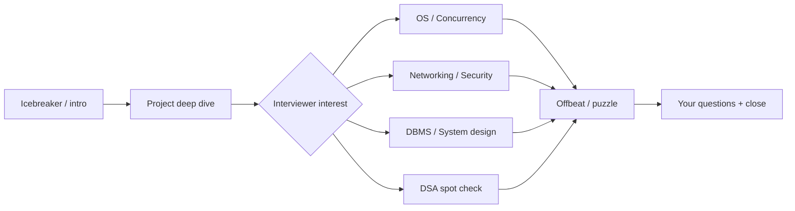
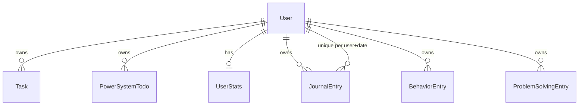

# Juspay Final Round — Interview Preparation (AttackMode / Habitify)

**Purpose:** Close the gap between your project docs and what Juspay’s **Final Onsite / Final Technical** round actually tests.  
**Sources:** Public interview experiences (2024–2025), your codebase review, and production-architecture design doc.  
**How to use:** Read Sections 1–3 once. Drill Section 4 (Q&A) daily. Day before: Section 5 Revision Sheet only.

---

## 1. What the Final Round Really Is

Juspay’s final round is **not** another LeetCode screen. It is a **1–3 hour deep technical conversation** that typically mixes:

| Block | Duration (typical) | What they test |
|-------|-------------------|----------------|
| Resume / project deep dive | 20–40 min | Every stack choice, schema, API, failure mode — **your AttackMode project** |
| System design (product-scoped) | 15–30 min | Scale, sharding, indexing, queues, idempotency — often tied to *your* app |
| OS & concurrency | 15–45 min | Threads, processes, memory, races, locks — scenario-based |
| Networking | 15–30 min | HTTP vs HTTPS, TLS, DNS, certificates — low-level “how” |
| DSA (selective) | 10–30 min | HashMap design, tree paths — **explain + sometimes code** |
| DBMS | 10–20 min | Indexes, transactions, sharding trade-offs |
| Offbeat / puzzles | 5–15 min | Keyboard press, math proofs — **thinking process**, not memorization |
| Cultural / behavioral | 5–15 min | Communication, hobbies, honesty when you don’t know |

**What gets people rejected (reported patterns):**
- Cannot articulate system design under time pressure  
- Correct approach but **no code** when they expected implementation  
- Defending weak choices without trade-offs (“because I like Next.js”)  
- Claiming production-ready when obvious gaps exist (no auth on APIs, no rate limits)  
- Freezing on offbeat questions instead of **structured decomposition**

**Your advantage:** AttackMode is a **real full-stack product** with auth, DB, AI, analytics — richer than a todo demo if you own the gaps honestly.

---

## 2. Final Round Playbook (2-Hour Model)

### Minute-by-minute strategy

| Phase | You should… |
|-------|-------------|
| **0–5** | 30s project hook: “identity OS — tasks, brain/muscle/money, journal, AI coach on Postgres.” |
| **5–25** | Whiteboard **request path** for one write: complete task → API → Prisma → stats counter. Mention transaction gap in MVP. |
| **25–45** | Let them steer: OS/CN/DB. Answer in **Why → Mechanism → Trade-off → Your project tie-in**. |
| **45–60** | If DSA: **start coding early** while talking — they may cut you off after approach. |
| **60–90** | Scale story: 100 → 10k → 100k users; what breaks first (AI cost, DB connections, GET stats writes). |
| **90–120** | Behavioral + “what you’d fix before prod.” End with 2 thoughtful questions. |

### Sentence templates (use verbatim when stuck)

- **Don’t know:** “I haven’t implemented that, but here’s how I’d reason: …”  
- **Trade-off:** “I chose X for velocity and Y constraint; at 100× I’d migrate to Z because …”  
- **Offbeat:** “I’ll decompose top-down: user action → OS → hardware → back …”  
- **Grilled on gap:** “In the repo today it’s X; production would be Y — here’s the migration.”

---

## 3. AttackMode — Project Deep-Dive Script (They Will Grill This)

Prepare to answer **without opening the laptop**:

### 3.1 One-liner
> AttackMode is a personal identity and productivity system: daily execution (tasks + brain/muscle/money habits), reflection (journal, behaviors), structured problem worksheets, and an AI coach grounded in the user’s own activity data — full-stack Next.js, PostgreSQL, JWT auth.

### 3.2 Stack — expect “Why?” on each

| Choice | 20-second answer | If they push |
|--------|------------------|--------------|
| **Next.js 15** | One deploy, API + UI, middleware for auth | Separate API when mobile + workers dominate |
| **PostgreSQL** | Relations, `(userId, date)` uniqueness, transactions for counters | Not Mongo — unused mongoose is dead dependency |
| **Prisma** | Schema-as-code, type-safe queries | Raw SQL for analytics; pooler at scale |
| **NextAuth JWT** | Horizontal scale, cookie session | `sessionVersion` for revoke; not localStorage |
| **TanStack Query** | Server-state cache, mutation invalidation | Not Redux |
| **DeepSeek** | Cost for coaching volume | Queue + rate limit; fail-soft if down |

### 3.3 Schema — draw from memory

**Say aloud:** Every child table has `userId` FK with `onDelete: Cascade`. Journal is **one entry per user per calendar day**. Power categories are enum-like strings: brain | muscle | money.

### 3.4 API they’ll pick apart

| Endpoint | Be ready to explain | Known weakness (own it) |
|----------|---------------------|-------------------------|
| `PUT /api/tasks/[id]` | Toggle complete + `userStats` increment | **Race:** no transaction — two tabs can double-count |
| `GET /api/user/stats` | Recomputes streak from 60-day activity | **Side effect:** GET writes DB; expensive under load |
| `POST /api/ai/chat` | 10 parallel Prisma reads → DeepSeek | **No rate limit** — cost abuse risk |
| `POST /api/auth/signup` | bcrypt cost 12, creates UserStats | Weak password rules; no email verify in MVP |

### 3.5 Failure modes — mandatory fluency

1. **DeepSeek down** → 503 on coach; CRUD unaffected  
2. **Postgres down** → full outage; show maintenance  
3. **Redis down** (ideal arch) → cache miss to DB; rate limit policy documented  
4. **Double submit complete** → lost update on counter; fix: `UPDATE ... WHERE completed=false` in TX  
5. **Timezone streak bug** → server UTC vs user local day; fix: store user TZ or UTC day key explicitly  

### 3.6 Production evolution (ideal — say “designed toward”)

Middleware auth → `requireUser` everywhere → Zod DTOs → Redis rate limits → BullMQ for stats/AI context → read replica for analytics.

---

## 4. Interview Q&A Bank (Juspay Final — Q161–Q240)

> Format: **Ideal answer** · **Common mistakes** · **Follow-up**

---

### P. Operating Systems (Q161–Q175)

#### Q161. What happens when you press a key on a keyboard?
**Ideal:** Keypress → USB HID report → keyboard controller → interrupt to CPU → OS keyboard driver enqueues scan code → windowing system dispatches to focused app → app translates to character via layout → render pipeline updates framebuffer.  
**Mistakes:** Jumping to “ASCII” with no OS layer.  
**Follow-up:** Mechanical vs membrane doesn’t change the OS path much — debouncing is hardware/firmware.

#### Q162. What happens when a PC boots?
**Ideal:** Power → firmware POST/UEFI → boot loader → kernel load → init/systemd → drivers → network/login → user session.  
**Mistakes:** Only “Windows starts.”  
**Follow-up:** Secure Boot verifies signed boot chain.

#### Q163. Process vs thread?
**Ideal:** Process = isolated address space; thread = shared memory, lighter context switch, needs sync for shared data.  
**Mistakes:** “Threads are faster always.”  
**Follow-up:** Node.js is single-threaded event loop + thread pool for some I/O/crypto.

#### Q164. What is a race condition? Example in your project?
**Ideal:** Outcome depends on interleaving without synchronization. In AttackMode, two concurrent `PUT` complete on same task can both read `completed=false` and increment `totalTasksCompleted` twice.  
**Mistakes:** Only textbook bank account, not your code.  
**Follow-up:** Fix with transaction + conditional update or idempotency key.

#### Q165. Mutex vs semaphore?
**Ideal:** Mutex = mutual exclusion, one owner; semaphore = counting resource pool.  
**Mistakes:** Using them interchangeably.  
**Follow-up:** DB row lock is like mutex for that row.

#### Q166. What is virtual memory?
**Ideal:** Each process sees contiguous virtual addresses; MMU maps to physical RAM or swap; enables isolation and overcommit.  
**Mistakes:** Confusing with disk cache only.  
**Follow-up:** Page fault → kernel loads page from disk.

#### Q167. Stack vs heap?
**Ideal:** Stack = function frames, automatic LIFO; heap = dynamic alloc, manual/GC lifetime.  
**Mistakes:** “Objects always on heap” without nuance.  
**Follow-up:** Stack overflow vs heap fragmentation.

#### Q168. Context switch cost?
**Ideal:** Save/restore registers, flush TLB entries, cache coldness — why threads aren’t free.  
**Mistakes:** “Context switch is instant.”  
**Follow-up:** Why async I/O reduces thread count.

#### Q169. Deadlock — four conditions?
**Ideal:** Mutual exclusion, hold-and-wait, no preemption, circular wait. Break one (ordering locks).  
**Mistakes:** Only defining deadlock, not prevention.  
**Follow-up:** DB deadlocks → retry transaction.

#### Q170. Single-core vs multi-core execution?
**Ideal:** Single-core time-slices threads; multi-core runs threads truly parallel — races become real without locks.  
**Mistakes:** Ignoring Node’s mostly single-threaded JS model.  
**Follow-up:** Worker threads for CPU-heavy bcrypt — rate limit login.

#### Q171. How does your Node server handle concurrent HTTP requests?
**Ideal:** Event loop on one thread; non-blocking I/O; Prisma uses connection pool to Postgres; CPU work blocks loop if sync.  
**Mistakes:** “Node is multithreaded for JS.”  
**Follow-up:** Move bcrypt/LLM to worker or limit concurrency.

#### Q172. What is copy-on-write?
**Ideal:** fork() shares pages until written — used in some DB snapshots and process spawn.  
**Mistakes:** Never heard of it.  
**Follow-up:** Postgres WAL + snapshots analogy at high level.

#### Q173. Page cache / buffer cache?
**Ideal:** OS caches disk blocks in RAM to speed reads; fsync flushes to disk.  
**Mistakes:** Thinking every write hits disk immediately.  
**Follow-up:** Postgres durability = WAL fsync policy.

#### Q174. User mode vs kernel mode?
**Ideal:** Syscalls trap to kernel for privileged ops (I/O, memory mapping).  
**Mistakes:** App “directly” talks to disk.  
**Follow-up:** Socket read is syscall → kernel TCP stack.

#### Q175. How would you make AttackMode’s stats update thread-safe?
**Ideal:** DB transaction: update task + increment stats atomically; or event table + single consumer worker; idempotent job processing.  
**Mistakes:** `let count++` in Node memory across requests.  
**Follow-up:** At scale, async worker from outbox.

---

### Q. Computer Networks (Q176–Q190)

#### Q176. HTTP vs HTTPS?
**Ideal:** HTTP cleartext; HTTPS = HTTP over TLS — confidentiality, integrity, server authentication.  
**Mistakes:** “HTTPS is encryption only” — ignore certs.  
**Follow-up:** HSTS prevents sslstrip.

#### Q177. TLS handshake (simplified)?
**Ideal:** ClientHello (ciphers) → ServerHello + cert → key exchange → session keys → encrypted Application Data.  
**Mistakes:** Skipping certificate step.  
**Follow-up:** TLS 1.3 reduces round trips.

#### Q178. How does the browser validate a certificate?
**Ideal:** Cert chain to trusted CA in store; check hostname, expiry, revocation (OCSP/CRL); signature verify.  
**Mistakes:** “Browser trusts any cert.”  
**Follow-up:** Self-signed fails unless manually trusted.

#### Q179. What is a CA? Why do we need it?
**Ideal:** Third party that signs server certs binding public key to domain identity — solves MITM without prior contact.  
**Mistakes:** CA “encrypts traffic.”  
**Follow-up:** Let’s Encrypt automates issuance.

#### Q180. Symmetric vs asymmetric encryption in HTTPS?
**Ideal:** Asymmetric (cert) establishes shared secret; symmetric (AES) encrypts bulk data for speed.  
**Mistakes:** RSA encrypts entire HTTP body.  
**Follow-up:** Perfect forward secrecy with ephemeral DH.

#### Q181. What is DNS? Walk through resolving google.com
**Ideal:** Resolver → root → TLD (.com) → authoritative NS → A/AAAA record → IP. Caching at each hop.  
**Mistakes:** Only “DNS gives IP.”  
**Follow-up:** A vs AAAA; TTL and cache poisoning awareness.

#### Q182. DNS over HTTPS / role of Cloudflare/Google DNS?
**Ideal:** Public resolvers, caching, optional privacy features — not the authority for your zone.  
**Mistakes:** Confusing registrar with resolver.  
**Follow-up:** Your app’s `DATABASE_URL` hostname still needs DNS.

#### Q183. TCP vs UDP?
**Ideal:** TCP reliable ordered stream; UDP datagrams, loss OK — DNS often UDP, QUIC uses UDP.  
**Mistakes:** “UDP is always faster so use it for APIs.”  
**Follow-up:** HTTP/3 over QUIC.

#### Q184. What happens when user loads https://yourapp.com/interview-prep?
**Ideal:** DNS → TCP + TLS → HTTP GET → CDN/static or Next server → HTML → fetch markdown → render.  
**Mistakes:** Skipping TLS.  
**Follow-up:** `Cache-Control` on static vs API.

#### Q185. REST API over HTTPS — where is auth?
**Ideal:** Session cookie `httpOnly` `Secure` `SameSite`; JWT in cookie not localStorage for XSS resistance.  
**Mistakes:** Bearer in localStorage without threat model.  
**Follow-up:** NextAuth session cookie model.

#### Q186. CORS — when does it matter?
**Ideal:** Browser blocks cross-origin reads unless ACAO header; same-origin Next app less issue; matters if SPA on another domain.  
**Mistakes:** “CORS secures the API” — server must still auth.  
**Follow-up:** Cookies need credentials + SameSite.

#### Q187. WebSocket vs HTTP for your coach?
**Ideal:** HTTP request/response fits MVP; WebSocket/SSE for streaming tokens later.  
**Mistakes:** WebSocket “because realtime” without need.  
**Follow-up:** SSE simpler one-way stream.

#### Q188. CDN — what do you cache for AttackMode?
**Ideal:** Static assets, `interview-prep.html`, public markdown; never authenticated `/api/*`.  
**Mistakes:** CDN cache user JSON.  
**Follow-up:** `private, no-store` on API.

#### Q189. DDoS vs application abuse?
**Ideal:** DDoS = volume at network edge (WAF, rate limit); abuse = valid sessions hitting expensive AI route — per-user quota.  
**Mistakes:** Only Cloudflare story, no app limits.  
**Follow-up:** Redis token bucket on `/api/ai/chat`.

#### Q190. Idempotency over the network — why?
**Ideal:** Clients retry on timeout; without idempotency duplicate POST creates duplicate tasks/charges. Use `Idempotency-Key` stored 24h.  
**Mistakes:** “POST is always safe to retry.”  
**Follow-up:** Juspay cares deeply — tie to payment semantics even if your app isn’t payments.

---

### R. DSA & Problem Solving (Q191–Q205)

#### Q191. Design a HashMap like C++ `unordered_map`
**Ideal:** Array of buckets; hash(key) % size; collision via chaining (linked list) or open addressing; resize when load factor > threshold; amortized O(1).  
**Mistakes:** No collision handling.  
**Follow-up:** Worst case O(n) if all keys collide — use good hash + resize.

#### Q192. Implement / explain inorder traversal
**Ideal:** Left → Node → Right; recursive or stack iterative; BST inorder = sorted order.  
**Mistakes:** Confuse with preorder.  
**Follow-up:** **Start writing code within 2 minutes** if asked.

#### Q193. Shortest path between two nodes in a tree
**Ideal:** LCA approach: paths from root to each node, walk parents, or single DFS recording path; O(n).  
**Mistakes:** BFS on tree without leveraging hierarchy.  
**Follow-up:** If binary tree, parent pointers simplify.

#### Q194. Two sum — approach?
**Ideal:** Hash map complement as you scan O(n).  
**Mistakes:** O(n²) without mentioning upgrade.  
**Follow-up:** Sorted array → two pointers.

#### Q195. Detect cycle in linked list
**Ideal:** Floyd slow/fast pointers.  
**Mistakes:** Visited set only without naming Floyd.  
**Follow-up:** Find cycle start — math on meeting point.

#### Q196. Stack vs queue — real use in your app?
**Ideal:** Stack = undo/recent DFS; queue = fair job processing (BullMQ).  
**Mistakes:** Abstract only.  
**Follow-up:** Rate limit sliding window often deque.

#### Q197. Time complexity of your `GET /api/user/stats` streak loop
**Ideal:** O(D) days up to 60 + O(T+P) fetch — acceptable per user; bad if called unbounded by crawler.  
**Mistakes:** “It’s O(1).”  
**Follow-up:** Precompute daily_activity table.

#### Q198. Binary search — when valid?
**Ideal:** Monotonic predicate on sorted array; O(log n).  
**Mistakes:** Unsorted array.  
**Follow-up:** First true in boolean array variant.

#### Q199. Heap — use case?
**Ideal:** Top-K, merge K sorted lists, priority queue for job scheduling.  
**Mistakes:** Confuse with BST.  
**Follow-up:** Scheduler for AI requests by priority tier.

#### Q200. BFS vs DFS — when?
**Ideal:** BFS shortest unweighted path; DFS connectivity/topological.  
**Mistakes:** Always DFS.  
**Follow-up:** Dependency graph of service startup order.

#### Q201. Tree of Space / thread-safe tree (Juspay hackathon lore)
**Ideal:** They may ask lock-free or custom sync without `mutex` — focus on **identifying shared mutable state**, ordering acquisitions, version counters, or immutability.  
**Mistakes:** Jumping to code without invariant list.  
**Follow-up:** State invariants aloud before coding.

#### Q202. Sliding window maximum
**Ideal:** Deque storing indices of useful candidates O(n).  
**Mistakes:** Re-scan window each time.  
**Follow-up:** Shows deque fluency.

#### Q203. LRU cache design
**Ideal:** Hash map + doubly linked list; get/put O(1); evict tail.  
**Mistakes:** O(n) eviction scan.  
**Follow-up:** Redis is distributed cache — different failure modes.

#### Q204. Serialize binary tree
**Ideal:** BFS/DFS with null markers; JSON array; handle duplicates/null.  
**Mistakes:** Lose structure without nulls.  
**Follow-up:** Schema versioning for persisted trees.

#### Q205. If interviewer says “implement while explaining”
**Ideal:** Scaffold function signature → happy path → edge cases → complexity — **type as you talk**.  
**Mistakes:** Silent coding for 5 minutes.  
**Follow-up:** Ask “Should I handle null input?” — shows discipline.

---

### S. DBMS & Distributed Systems (Q206–Q215)

#### Q206. ACID — give examples from AttackMode
**Ideal:** Complete task + increment counter should be **Atomic**; userId scoping **Consistent**; Postgres default **Isolated**; commit **Durable** via WAL.  
**Mistakes:** Define letters without app tie-in.  
**Follow-up:** MVP violates atomicity — you’d fix with TX.

#### Q207. Indexing strategy for your schema
**Ideal:** `(userId, completed)` tasks; `(userId, date)` power todos; unique `(userId, date)` journal; list endpoints need `userId` prefix.  
**Mistakes:** Index every column.  
**Follow-up:** EXPLAIN ANALYZE on slow list.

#### Q208. When to shard?
**Ideal:** Single Postgres vertical scale first; shard by `userId` when storage/connection limits hit — cross-shard queries expensive.  
**Mistakes:** Shard at 100 users.  
**Follow-up:** Citus / manual shard routing.

#### Q209. Read replica use case
**Ideal:** Analytics `/api/analytics`, coach context historical reads; accept replication lag.  
**Mistakes:** Read replica for strong consistency counters.  
**Follow-up:** “read your writes” → primary.

#### Q210. Normalization vs denormalization here
**Ideal:** Normalized entities; denormalized `UserStats` for fast dashboard — reconcile async.  
**Mistakes:** Fully denormalize journal into tasks.  
**Follow-up:** Event sourcing as future evolution.

#### Q211. CAP at payment scale (conceptual)
**Ideal:** Partition tolerance mandatory in distributed; choose CP vs AP per operation — balances CP, notifications AP with reconciliation.  
**Mistakes:** “CAP is obsolete” without nuance.  
**Follow-up:** Your app is mostly single-region CP on Postgres.

#### Q212. Optimistic vs pessimistic locking
**Ideal:** Optimistic = version column check on update; pessimistic = `SELECT FOR UPDATE` in transaction.  
**Mistakes:** Only one approach always.  
**Follow-up:** Task complete → pessimistic or conditional update.

#### Q213. Connection pooling — why?
**Ideal:** Postgres connections expensive; Prisma pool reuses; serverless needs PgBouncer/Accelerate.  
**Mistakes:** New connection per request unbounded.  
**Follow-up:** 10k users → pool exhaustion breaks first.

#### Q214. Migration without downtime
**Ideal:** Expand-contract: add column → dual write → backfill → switch read → drop old.  
**Mistakes:** Rename column in place breaking deploy.  
**Follow-up:** Prisma migrate in CI with backup.

#### Q215. SQL injection in your stack?
**Ideal:** Prisma parameterizes; risk if raw `queryUnsafe` with concatenation — never do.  
**Mistakes:** “ORM means no injection.”  
**Follow-up:** Validate with Zod before DB.

---

### T. Behavioral, Cultural & Communication (Q216–Q225)

#### Q216. Tell me about yourself (2 min)
**Ideal:** Background → why systems/productivity → AttackMode what you built → what you’re looking for (depth, ownership).  
**Mistakes:** Resume chronology without arc.  
**Follow-up:** Tie to Juspay: high-stakes reliability thinking.

#### Q217. Hardest bug / technical challenge?
**Ideal:** STAR: timezone streak / double-fetch / auth gap — what you learned.  
**Mistakes:** Vague “debugging is hard.”  
**Follow-up:** Show systematic approach.

#### Q218. Disagreement with teammate?
**Ideal:** Data + prototype + decide; document ADR; disagree and commit.  
**Mistakes:** “I was right.”  
**Follow-up:** Pragmatism over ego.

#### Q219. Why Juspay?
**Ideal:** Payments-grade engineering, depth in distributed systems, small teams with large impact — connect to your interest in reliability and correctness.  
**Mistakes:** Only “package.”  
**Follow-up:** Mention idempotency culture fit.

#### Q220. Hobby / outside work?
**Ideal:** Genuine answer — fitness, reading, building — shows balance.  
**Mistakes:** “I only code.”  
**Follow-up:** They use it for culture fit.

#### Q221. What are you weakest at?
**Ideal:** Honest area + how you’re improving (e.g., system design under clock → mock interviews).  
**Mistakes:** “I’m perfectionist.”  
**Follow-up:** Shows growth mindset.

#### Q222. How do you handle not knowing an answer?
**Ideal:** Decompose, state assumptions, reason aloud — exactly this doc’s offbeat framework.  
**Mistakes:** Bluf or freeze.  
**Follow-up:** They **want** this behavior.

#### Q223. Questions for us?
**Ideal:** Team on-call culture; how they balance hackathon innovation vs prod stability; mentorship.  
**Mistakes:** No questions.  
**Follow-up:** Shows senior curiosity.

#### Q224. Explain a decision you’d revert
**Ideal:** Originally client-only AuthGuard as the page gate → shipped `src/middleware.ts` with NextAuth `getToken` (pages redirect, APIs 401); AuthGuard kept for hydration UX only.  
**Mistakes:** Never revert anything.  
**Follow-up:** Shows learning.

#### Q225. How do you prioritize tech debt?
**Ideal:** Risk matrix: security/auth > data integrity > perf > style; bundle debt sprints.  
**Mistakes:** “We don’t have debt.”  
**Follow-up:** mongoose removal example.

---

### U. Offbeat & Puzzle Framework (Q226–Q235)

#### Q226. Why is hypotenuse longest in right triangle?
**Ideal:** Pythagoras: a²+b²=c²; c > a,b if a,b>0; or geometric proof by contradiction.  
**Mistakes:** “It’s obvious.”  
**Follow-up:** They want **reasoning**, not memorized proof.

#### Q227. Generic offbeat template
**Ideal:** 1) Restate 2) Layers (user→app→OS→HW→back) 3) State unknowns 4) Converge 5) Sanity check.  
**Mistakes:** “I don’t know” immediately.  
**Follow-up:** Practice on “how does mouse move cursor?”

#### Q228. Probability: coin tosses / expected value
**Ideal:** Define sample space; linearity of expectation; conditional probability if needed.  
**Mistakes:** Intuition only.  
**Follow-up:** Quick: E[two heads in 3 flips] — calculate.

#### Q229. Puzzle: 100 doors / locker problem
**Ideal:** Perfect squares stay open — factor pairs.  
**Mistakes:** Brute force only.  
**Follow-up:** Shows number theory pattern recognition.

#### Q230. Estimate: how much data does your app store per user per year?
**Ideal:** Assumptions: tasks/day, journal bytes, behaviors — multiply → KB/MB; DB growth plan.  
**Mistakes:** No structure.  
**Follow-up:** Fermi estimation skill.

#### Q231–Q235. Rapid fire readiness
| Question | One-line ideal |
|----------|----------------|
| Big-endian vs little-endian | Byte order in multi-byte integers |
| IPv4 vs IPv6 | Address space; NAT vs end-to-end |
| What is inode? | File metadata index in Unix FS |
| Thrashing | Excessive paging, CPU spent on swap |
| Thundering herd | Many workers wake on same event — jitter/singleflight |

---

## 5. Juspay Final — Day-Before Revision Sheet

### Must recite cold
1. **30s pitch** + **2min architecture**  
2. **Complete-task race** + transaction fix  
3. **JWT vs DB session** + middleware vs AuthGuard vs `requireUser`  
4. **TLS handshake + cert validation** (Q177–Q178)  
5. **Idempotency-Key** on POST (Q190, Q80)  
6. **HashMap design** (Q191) — buckets + resize  
7. **100 → 10k → 100k** what breaks (connections, AI cost, GET stats)  
8. **Honest gaps:** mongoose unused, no rate limit, GET writes  

### Red flags to avoid saying
- “It’s production-ready” unqualified  
- “MongoDB is our database”  
- “AuthGuard secures the app”  
- “We don’t need transactions”  
- Silent when unsure  

### Green flags to demonstrate
- Trade-offs unprompted  
- Tie fundamentals to **your** code  
- Code early when DSA hinted  
- Ask clarifying questions  
- Document failure modes  
- Say: middleware authenticates; handlers authorize by `userId`  

### Interview readiness (Juspay Final focus)

| Dimension | Target | Your prep doc |
|-----------|--------|---------------|
| Project depth | 90% | Sections 3 + Engineering Review Part 20 |
| System design | 85% | Design doc scalability + this Section 3.6 |
| OS / Concurrency | 75% | Q161–Q175 drill |
| Networking / TLS | 75% | Q176–Q190 drill |
| DSA | 70% | Q191–Q205 — **practice writing** |
| Communication | 85% | Q216–Q225 |
| Offbeat composure | 70% | Q226–Q230 framework |

**Combined readiness after drilling this doc: ~78 → 88/100** (if you practice aloud 3 days).

---

## 6. Cross-Reference Map

| Topic | Primary doc | Section |
|-------|-------------|---------|
| Real code paths & API matrix | `INTERVIEW_ENGINEERING_REVIEW.md` | Parts 2, 7, 20 |
| Ideal production architecture | `INTERVIEW_DESIGN_DOCUMENT.md` | All + Q1–Q160 |
| Juspay final OS/CN/DSA/behavioral | **This file** | Q161–Q235 |
| Web study UI | `/interview-prep.html` | Tab: Juspay Final |

---

*End of Juspay Final Round Prep — drill daily, code when asked, own the gaps.*
